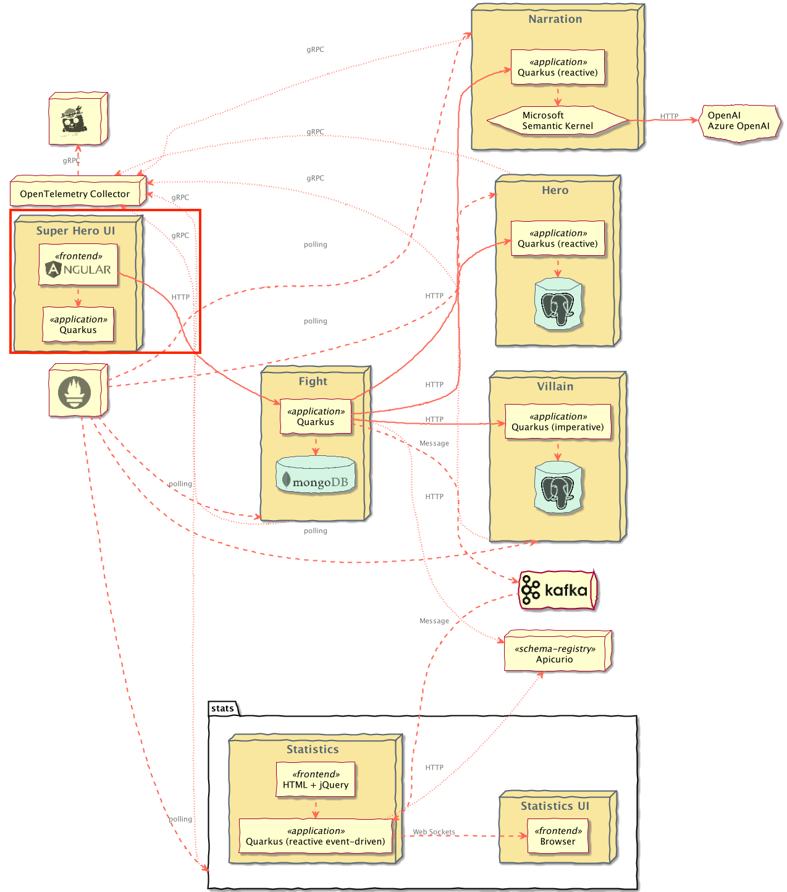
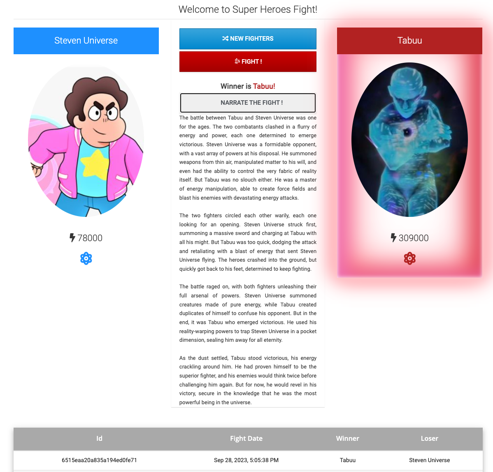
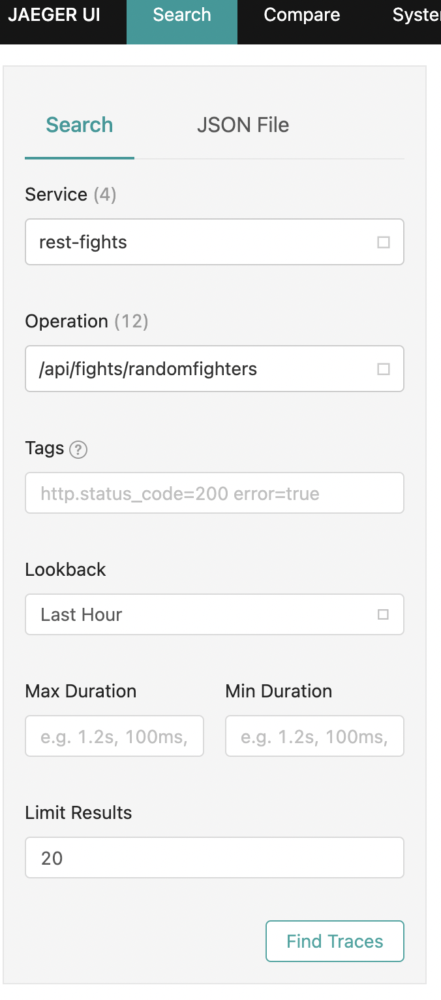
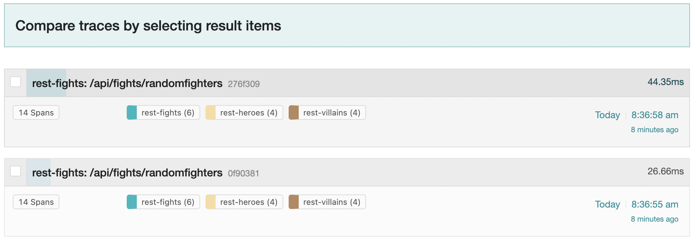
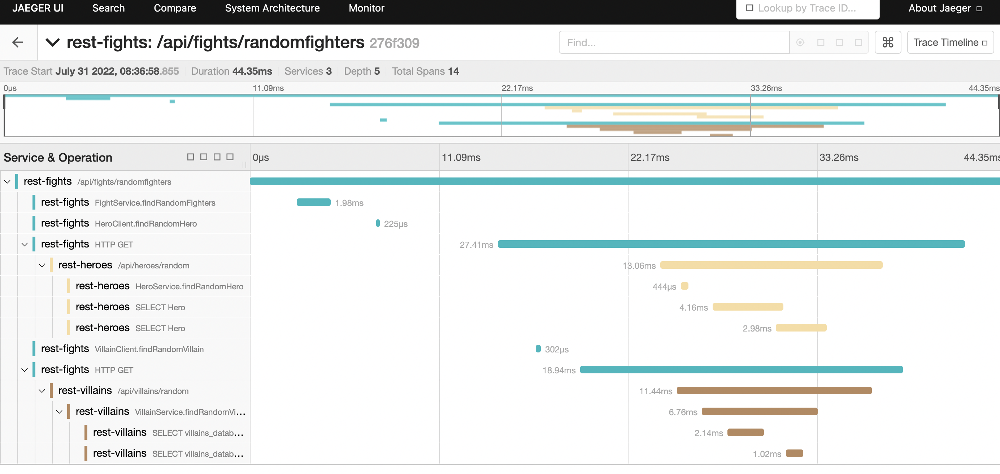

# Quarkus Superheroes Sample

## Table of Contents
- [Introduction](#introduction)
- [Project automation](docs/automation.md)
    - [GitHub action automation](docs/automation.md#github-action-automation)
    - [Application Resource Generation](docs/automation.md#application-resource-generation)
- [Running Locally via Docker Compose](#running-locally-via-docker-compose)
- [Deploying to Kubernetes](#deploying-to-kubernetes)
    - [Routing](#routing)
    - [Versions](#versions)
    - [Monitoring](#monitoring)
    - [Jaeger](#jaeger)
- [Deploying to Azure Container Apps](docs/deploying-to-azure-containerapps.md)

## Introduction

This is a sample application demonstrating Quarkus features and best practices. The application allows superheroes to fight against supervillains. The application consists of several microservices, communicating either synchronously via REST or asynchronously using Kafka. All the data used by the applications are [on the `characterdata` branch](https://github.com/quarkusio/quarkus-super-heroes/tree/characterdata) of this repository.

The base JVM version for all the applications is Java 17.

- [Super Hero Battle UI](ui-super-heroes)
    - An Angular application to pick up a random superhero, a random supervillain, and makes them fight.
    - Served with [Quarkus Quinoa](https://quarkiverse.github.io/quarkiverse-docs/quarkus-quinoa/dev/index.html)
- [Villain REST API](rest-villains)
    - A classical HTTP microservice exposing CRUD operations on Villains, stored in a PostgreSQL database.
    - Implemented with blocking endpoints using [RESTEasy Reactive](https://quarkus.io/guides/resteasy-reactive) and [Quarkus Hibernate ORM with Panache's active record pattern](https://quarkus.io/guides/hibernate-orm-panache).
    - Favors field injection of beans (`@Inject` annotation) over construction injection.
    - Uses the [Quarkus Qute templating engine](https://quarkus.io/guides/qute) for its [UI](rest-villains/README.md#running-the-application).
    - Contains [contract verification tests](rest-villains/README.md#contract-testing-with-pact) using [Pact](https://pact.io).
- [Hero REST API](rest-heroes)
    - A reactive HTTP microservice exposing CRUD operations on Heroes, stored in a PostgreSQL database.
    - Implemented with reactive endpoints using [RESTEasy Reactive](https://quarkus.io/guides/resteasy-reactive) and [Quarkus Hibernate Reactive with Panache's repository pattern](http://quarkus.io/guides/hibernate-reactive-panache).
    - Favors constructor injection of beans over field injection (`@Inject` annotation).
    - Uses the [Quarkus Qute templating engine](https://quarkus.io/guides/qute) for its [UI](rest-heroes/README.md#running-the-application).
    - Contains [contract verification tests](rest-heroes/README.md#contract-testing-with-pact) using [Pact](https://pact.io).
- [Fight REST API](rest-fights)
    - A REST API invoking the Hero and Villain APIs to get a random superhero and supervillain. Each fight is then stored in a MongoDB database.
    - Implemented with reactive endpoints using [RESTEasy Reactive](https://quarkus.io/guides/resteasy-reactive) and [Quarkus MongoDB Reactive with Panache's active record pattern](https://quarkus.io/guides/mongodb-panache#reactive).
    - Invocations to the Hero and Villain APIs are done using the [reactive rest client](https://quarkus.io/guides/rest-client-reactive) and are protected using [resilience patterns](https://quarkus.io/guides/smallrye-fault-tolerance), such as retry, timeout, and circuit breaking.
    - Each fight is asynchronously sent, via Kafka, to the [Statistics](event-statistics) microservice.
        - Messages on Kafka use [Apache Avro](https://avro.apache.org/docs/current) schemas and are stored in an [Apicurio Registry](https://www.apicur.io/registry), all using [built-in support from Quarkus](https://quarkus.io/guides/kafka-schema-registry-avro).
    - Contains [consumer contract and contract verification tests](rest-fights/README.md#contract-testing-with-pact) using [Pact](https://pact.io).
- [Statistics](event-statistics)
    - Calculates statistics about each fight and serves them to an HTML + JQuery UI using [WebSockets](https://quarkus.io/guides/websockets).
- [Prometheus](https://prometheus.io/)
    - Polls metrics from all the services within the system.
- [OpenTelemetry Collector](https://opentelemetry.io/docs/collector)
    - All services export distributed trace information to the collector.
- [Jaeger](https://www.jaegertracing.io)
    - The collector exports trace information into Jaeger.

Here is an architecture diagram of the application:

The main UI allows you to pick one random Hero and Villain by clicking on _New Fighters_. Then, click _Fight!_ to start the battle. The table at the bottom shows the list of previous fights.

## Running Locally via Docker Compose
Pre-built images for all of the applications in the system can be found at [`quay.io/quarkus-super-heroes`](http://quay.io/quarkus-super-heroes).

Pick one of the 4 versions of the application from the table below and execute the appropriate docker compose command from the `quarkus-super-heroes` directory.

   > **NOTE**: You may see errors as the applications start up. This may happen if an application completes startup before one if its required services (i.e. database, kafka, etc). This is fine. Once everything completes startup things will work fine.
   >
   > There is a [`watch-services.sh`](scripts/watch-services.sh) script that can be run in a separate terminal that will watch the startup of all the services and report when they are all up and ready to serve requests. 
   >
   > Run `scripts/watch-services.sh -h` for details about it's usage.

| Description | Image Tag       | Docker Compose Run Command                                               | Docker Compose Run Command with Monitoring                                                                       |
|-------------|-----------------|--------------------------------------------------------------------------|------------------------------------------------------------------------------------------------------------------|
| JVM Java 17 | `java17-latest` | `docker compose -f deploy/docker-compose/java17.yml up --remove-orphans` | `docker compose -f deploy/docker-compose/java17.yml -f deploy/docker-compose/monitoring.yml up --remove-orphans` |
| Native      | `native-latest` | `docker compose -f deploy/docker-compose/native.yml up --remove-orphans` | `docker compose -f deploy/docker-compose/native.yml -f deploy/docker-compose/monitoring.yml up --remove-orphans` |

> **NOTE:** If your system does not have the `compose` sub-command, you can try the above commands with the `docker-compose` command instead of `docker compose`.

Once started the main application will be exposed at `http://localhost:8080`. If you want to watch the [Event Statistics UI](event-statistics), that will be available at `http://localhost:8085`. The Apicurio Registry will be available at `http://localhost:8086`.

If you launched the monitoring stack, Prometheus will be available at `http://localhost:9090` and Jaeger will be available at `http://localhost:16686`.

## Deploying to Kubernetes
Pre-built images for all of the applications in the system can be found at [`quay.io/quarkus-super-heroes`](http://quay.io/quarkus-super-heroes).

Deployment descriptors for these images are provided in the [`deploy/k8s`](deploy/k8s) directory. There are versions for [OpenShift](https://www.openshift.com), [Minikube](https://quarkus.io/guides/deploying-to-kubernetes#deploying-to-minikube), [Kubernetes](https://www.kubernetes.io), and [KNative](https://knative.dev).

The only real difference between the Minikube and Kubernetes descriptors is that all the application `Service`s in the Minikube descriptors use `type: NodePort` so that a list of all the applications can be obtained simply by running `minikube service list`.

> **NOTE:** If you'd like to deploy each application directly from source to Kubernetes, please follow the guide located within each application's folder (i.e. [`event-statistics`](event-statistics/README.md#deploying-directly-via-kubernetes-extensions), [`rest-fights`](rest-fights/README.md#deploying-directly-via-kubernetes-extensions), [`rest-heroes`](rest-heroes/README.md#deploying-directly-via-kubernetes-extensions), [`rest-villains`](rest-villains/README.md#deploying-directly-via-kubernetes-extensions)).

### Routing
Both the Minikube and Kubernetes descriptors also assume there is an [Ingress Controller](https://kubernetes.io/docs/concepts/services-networking/ingress-controllers/) installed and configured. There is a single `Ingress` in the Minikube and Kubernetes descriptors denoting `/` and `/api/fights` paths. You may need to add/update the `host` field in the `Ingress` as well in order for things to work.

Both the [`ui-super-heroes`](ui-super-heroes) and the [`rest-fights`](rest-fights) applications need to be exposed from outside the cluster. On Minikube and Kubernetes, the [`ui-super-heroes`](ui-super-heroes) Angular application communicates back to the same host and port as where it was launched from under the `/api/fights` path. [See the routing section in the UI project](ui-super-heroes/README.md#routing) for more details.

On OpenShift, the URL containing the `ui-super-heroes` host name is replaced with `rest-fights`. This is because the OpenShift descriptors use `Route` objects for gaining external access to the application. In most cases, no manual updating of the OpenShift descriptors is needed before deploying the system. Everything should work as-is.

Additionally, there is also a `Route` for the [`event-statistics`](event-statistics) application. On Minikube or Kubernetes, you will need to expose the [`event-statistics`](event-statistics) application, either by using an `Ingress` or doing a `kubectl port-forward`. The [`event-statistics`](event-statistics) application runs on port `8085`.

### Versions
Pick one of the 4 versions of the system from the table below and deploy the appropriate descriptor from the [`deploy/k8s` directory](deploy/k8s). Each descriptor contains all of the resources needed to deploy a particular version of the entire system.

   > **NOTE:** These descriptors are **NOT** considered to be production-ready. They are basic enough to deploy and run the system with as little configuration as possible. The databases, Kafka broker, and schema registry deployed are not highly-available and do not use any Kubernetes operators for management or monitoring. They also only use ephemeral storage.
   >
   > For production-ready Kafka brokers, please see the [Strimzi documentation](https://strimzi.io/) for how to properly deploy and configure production-ready Kafka brokers on Kubernetes. You can also try out a [fully hosted and managed Kafka service](https://developers.redhat.com/products/red-hat-openshift-streams-for-apache-kafka/getting-started)!
   >
   > For a production-ready Apicurio Schema Registry, please see the [Apicurio Registry Operator documentation](https://www.apicur.io/registry/docs/apicurio-registry-operator/1.0.0/index.html). You can also try out a [fully hosted and managed Schema Registry service](https://console.redhat.com/application-services/service-registry)!

| Description | Image Tag       | OpenShift Descriptor                                      | Minikube Descriptor                                     | Kubernetes Descriptor                                       | KNative Descriptor                                    |
|-------------|-----------------|-----------------------------------------------------------|---------------------------------------------------------|-------------------------------------------------------------|-------------------------------------------------------|
| JVM Java 17 | `java17-latest` | [`java17-openshift.yml`](deploy/k8s/java17-openshift.yml) | [`java17-minikube.yml`](deploy/k8s/java17-minikube.yml) | [`java17-kubernetes.yml`](deploy/k8s/java17-kubernetes.yml) | [`java17-knative.yml`](deploy/k8s/java17-knative.yml) |
| Native      | `native-latest` | [`native-openshift.yml`](deploy/k8s/native-openshift.yml) | [`native-minikube.yml`](deploy/k8s/native-minikube.yml) | [`native-kubernetes.yml`](deploy/k8s/native-kubernetes.yml) | [`native-knative.yml`](deploy/k8s/native-knative.yml) |

### Monitoring
There are also Kubernetes deployment descriptors for monitoring with [OpenTelemetry](https://opentelemetry.io), [Prometheus](https://prometheus.io), and [Jaeger](https://www.jaegertracing.io) in the [`deploy/k8s` directory](deploy/k8s) ([`monitoring-openshift.yml`](deploy/k8s/monitoring-openshift.yml), [`monitoring-minikube.yml`](deploy/k8s/monitoring-minikube.yml), [`monitoring-kubernetes.yml`](deploy/k8s/monitoring-kubernetes.yml)). Each descriptor contains the resources necessary to monitor and gather metrics and traces from all of the applications in the system. Deploy the appropriate descriptor to your cluster if you want it.

The OpenShift descriptor will automatically create `Route`s for Prometheus and Jaeger. On Kubernetes/Minikube you may need to expose the Prometheus and Jaeger services in order to access them from outside your cluster, either by using an `Ingress` or by using `kubectl port-forward`. On Minikube, the Prometheus and Jaeger `Service`s are also exposed as a `NodePort`.

   > **NOTE:** These descriptors are **NOT** considered to be production-ready. They are basic enough to deploy Prometheus, Jaeger, and the [OpenTelemetry Collector](https://opentelemetry.io/docs/collector) with as little configuration as possible. They are not highly-available and does not use any Kubernetes operators for management or monitoring. They also only uses ephemeral storage.
   >
   > For production-ready Prometheus instances, please see the [Prometheus Operator documentation](https://operatorhub.io/operator/prometheus) for how to properly deploy and configure production-ready instances. 
   >
   > For production-ready Jaeger instances, please see the [Jaeger Operator documentation](https://operatorhub.io/operator/jaeger) for how to properly deploy and configure production-ready instances.
   >
   > For production-ready OpenTelemetry Collector instances, please see the [OpenTelemetry Operator documentation](https://operatorhub.io/operator/opentelemetry-operator) for how to properly deploy and configure production-ready instances.

### Jaeger

By now you've performed a few battles, so let's analyze the telemetry data.
Open the Jaeger UI based on how you are running the system, either through Docker Compose or by deploying the monitoring stack to kubernetes.

Now, let's analyze the traces for when requesting new fighters.
When clicking the **New Fighters** button in the Superheroes UI, the browser makes an HTTP request to the `/api/fights/randomfighters` endpoint within the `rest-fights` application.
In the Jaeger UI, select `rest-fights` for the Service and `/api/fights/randomfighters` for the Operation, then click **Find Traces**.
You should see all the traces corresponding to the request of getting new fighters.

Then, select one trace.
A trace consists of a series of spans.
Each span is a time interval representing a unit of work.
Spans can have a parent/child relationship and form a hierarchy.
You can see that each trace contains 14 total spans:
six spans in the `rest-fights` application, four spans in the `rest-heroes` application, and four spans in the `rest-villains` application.
Each trace also provides the total round-trip time of the request into the `/api/fights/randomfighters` endpoint within the `rest-fights` application and the total time spent within each unit of work.

