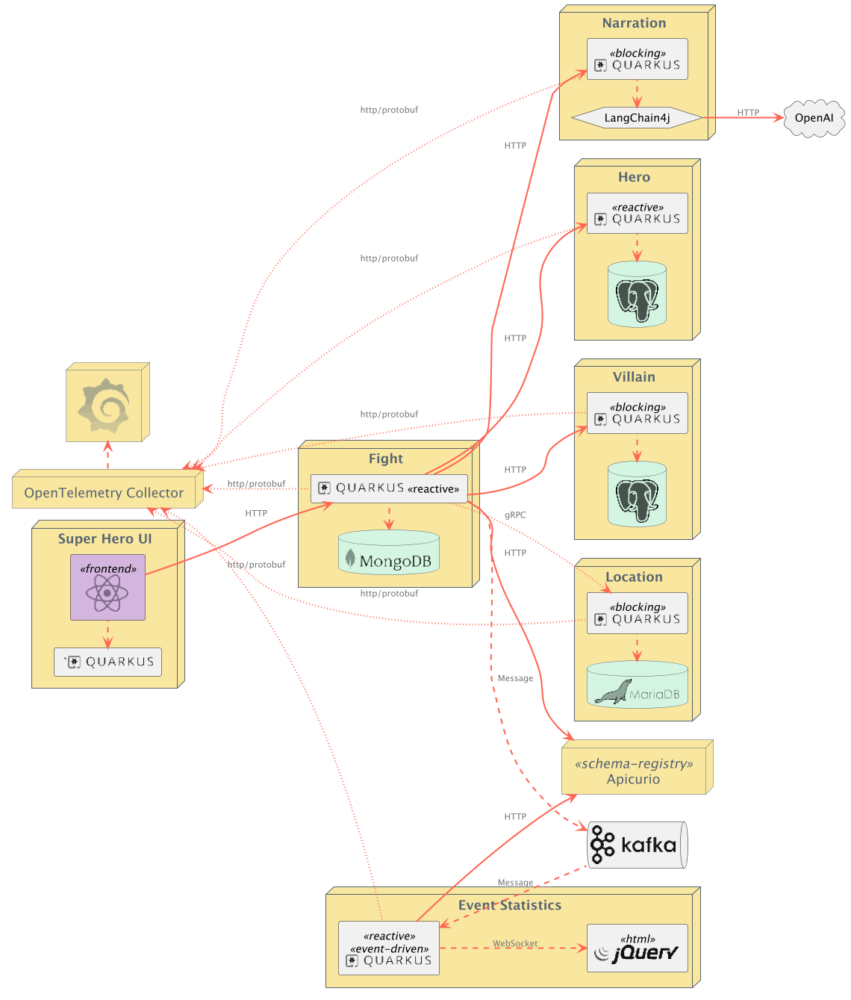
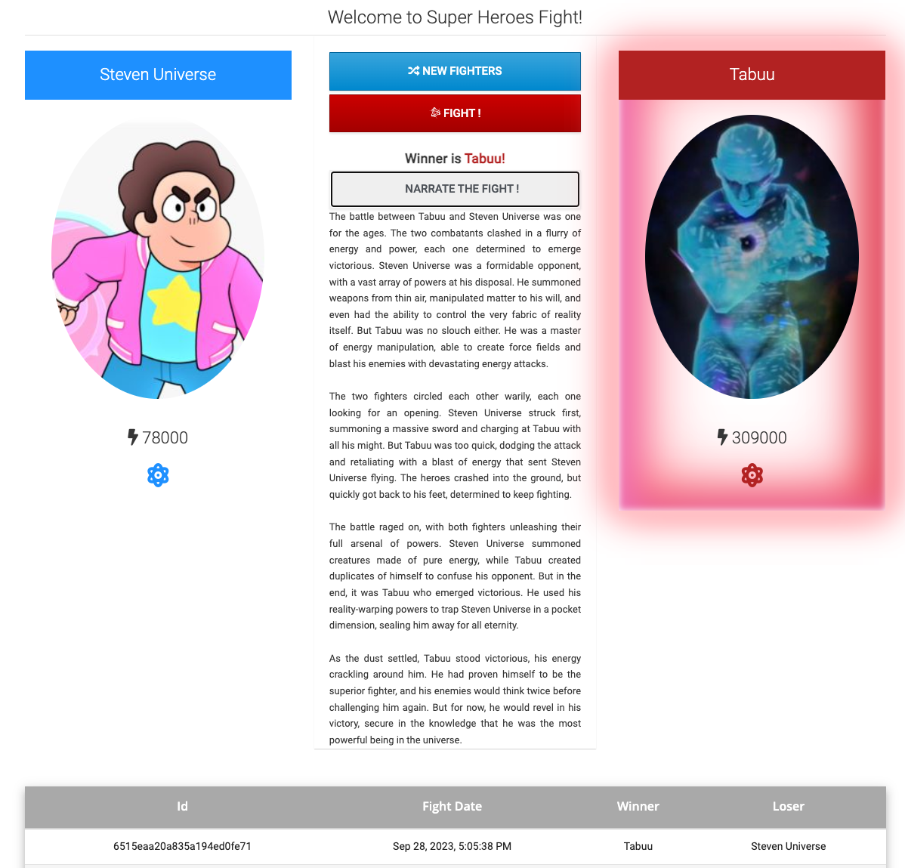

# Quarkus Superheroes Sample

> **Full documentation: [https://quarkus-super-heroes.quarkus.io](https://quarkus-super-heroes.quarkus.io)**

## Introduction

This is a sample application demonstrating Quarkus features and best practices. The application allows superheroes to fight against supervillains. The application consists of several microservices, communicating either synchronously via REST or asynchronously using Kafka. All the data used by the applications are [on the `characterdata` branch](https://github.com/quarkusio/quarkus-super-heroes/tree/characterdata) of this repository.

This is **NOT** the workshop with the step-by-step instructions. If you are looking for the Quarkus Super Heroes workshop, you can find it at https://quarkus.io/quarkus-workshops/super-heroes/.

This is **NOT** a single multi-module project. Each service in the system is its own sub-directory of this parent directory. As such, each individual service needs to be run on its own.

The base JVM version for all the applications is Java 21.

- [Super Hero Battle UI](ui-super-heroes) - A React application served via [Quarkus Quinoa](https://quarkiverse.github.io/quarkiverse-docs/quarkus-quinoa/dev/index.html)
- [Villain REST API](rest-villains) - A classical HTTP microservice with [Hibernate ORM with Panache](https://quarkus.io/guides/hibernate-orm-panache) (active record pattern)
- [Hero REST API](rest-heroes) - A reactive HTTP microservice with [Hibernate Reactive with Panache](http://quarkus.io/guides/hibernate-reactive-panache) (repository pattern)
- [Narration REST API](rest-narration) - A blocking HTTP microservice integrating with [OpenAI](https://openai.com/) via [LangChain4J](https://docs.quarkiverse.io/quarkus-langchain4j/dev/index.html)
- [Location gRPC API](grpc-locations) - A [Kotlin](https://quarkus.io/guides/kotlin) [gRPC](https://quarkus.io/guides/grpc) microservice with [Hibernate ORM with Panache](https://quarkus.io/guides/hibernate-orm-panache-kotlin)
- [Fight REST API](rest-fights) - A reactive HTTP microservice orchestrating fights, using [MongoDB](https://quarkus.io/guides/mongodb-panache), [Kafka](https://quarkus.io/guides/kafka-schema-registry-avro), and [resilience patterns](https://quarkus.io/guides/smallrye-fault-tolerance)
- [Event Statistics](event-statistics) - An event-driven microservice consuming Kafka events and serving statistics via [WebSockets](https://quarkus.io/guides/websockets)
- [Grafana LGTM Stack](https://github.com/grafana/docker-otel-lgtm) - All services export traces, metrics, and logs via OpenTelemetry (OTLP)



The main UI allows you to pick one random Hero and Villain by clicking on _New Fighters_. Then, click _Fight!_ to start the battle. The table at the bottom shows the list of previous fights.



## Running Locally

See the [Running Locally](https://quarkus-super-heroes.quarkus.io/running-locally) guide for Docker Compose instructions, or run any individual service in dev mode:

```bash
cd rest-heroes && ./mvnw quarkus:dev
```

## Deploying to Kubernetes

See the [Deploying to Kubernetes](https://quarkus-super-heroes.quarkus.io/deploying) guide for full instructions on deploying to OpenShift, Minikube, Kubernetes, and Knative using pre-built images, Helm charts, or Quarkus Kubernetes Extensions.

## CI/CD Automation

See the [CI/CD Automation](https://quarkus-super-heroes.quarkus.io/automation) guide for details on the GitHub Action workflows and application resource generation.
