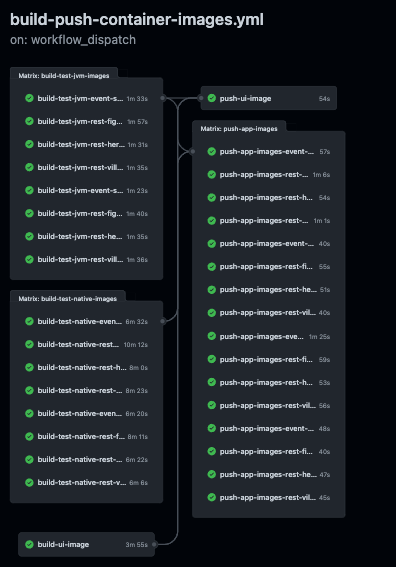

# Table of Contents
- [Introduction](#introduction)
- [GitHub action automation](#github-action-automation)
    - [Basic building and testing](#basic-building-and-testing-workflow)
    - [Build and push container images](#build-and-push-container-images-workflow)
        - [Build JVM container image job](#build-jvm-container-images-job)
        - [Build native container image job](#build-native-container-images-job)
        - [Push application container images job](#push-application-container-images-job)
        - [Create application multi-arch manifests](#create-application-multi-arch-manifests)
    - [Create deploy resources](#create-deploy-resources-workflow)
    - [Cleanup artifacts](#cleanup-artifacts)
- [Application Resource Generation](#application-resource-generation)
    - [Kubernetes (and variants) resource generation](#kubernetes-and-variants-resource-generation)
    - [Docker compose resource generation](#docker-compose-resource-generation)

# Introduction
This document describes the overall automation strategy for the Quarkus superheroes services and how all the automation behind it works. There is a lot of automation and resource generation that happens "behind the scenes" when changes are pushed to the GitHub repo.

# GitHub action automation
There are 3 GitHub action workflows that run when code is pushed: [Basic building and testing](#basic-building-and-testing-workflow), [Build and push container images](#build-and-push-container-images-workflow), and [Create deploy resources](#create-deploy-resources-workflow).

## Basic building and testing workflow
The [Basic building and testing](../.github/workflows/simple-build-test.yml) workflow is a "sanity check". It is required to pass before pull requests can be merged.

It runs whenever code is pushed to the `main` branch as well as upon any pull requests.
   > The workflow can also be [triggered manually](https://docs.github.com/en/actions/managing-workflow-runs/manually-running-a-workflow).

It runs `./mvnw clean verify` and `./mvnw clean verify -Pnative` on the [`event-statistics`](../event-statistics), [`rest-fights`](../rest-fights), [`rest-heroes`](../rest-heroes), [`rest-villains`](../rest-villains), and [`ui-super-heroes`](../ui-super-heroes) applications on Java 17.

## Build and push container images workflow
The [Build and push container images](../.github/workflows/build-push-container-images.yml) workflow does pretty much what it sounds like: builds and pushes container images. For JVM images, it builds both `amd64` and `arm64` images. Multi-arch native images are coming soon.

It only runs on pushes to the `main` branch after successful completion of the above [_Basic building and testing_](#basic-building-and-testing-workflow) workflow.
   > The workflow can also be [triggered manually](https://docs.github.com/en/actions/managing-workflow-runs/manually-running-a-workflow).

It consists of 4 jobs: 
- [_Build JVM container images_](#build-jvm-container-images-job)
- [_Build native container images_](#build-native-container-images-job)
- [_Push application container images_](#push-application-container-images-job)
- [Create application multi-arch manifests](#create-application-multi-arch-manifests)

If any step in any of the jobs fail then the entire workflow fails.

This image is a visual of what the workflow consists of:

### Build JVM container images job
This job [Builds JVM container images](https://quarkus.io/guides/container-image#building) for the [`event-statistics`](../event-statistics), [`rest-fights`](../rest-fights), [`rest-heroes`](../rest-heroes), [`rest-villains`](../rest-villains), and  [`ui-super-heroes`](../ui-super-heroes) applications on Java 17 (both amd64 & arm64 platforms) using the [Docker Build action](https://github.com/docker/build-push-action).

Each container image created has 4 tags:
- `{{app-version}}-quarkus-{{quarkus-version}}-java{{java-version}}-amd64`
- `{{app-version}}-quarkus-{{quarkus-version}}-java{{java-version}}-arm64`
- `java{{java-version}}-latest-amd64`
- `java{{java-version}}-latest-arm64`

> - Replace `{{app-version}}` with the application version (i.e. `1.0`).
> - Replace `{{quarkus-version}}` with Quarkus version the application uses (i.e. `3.0.3.Final`).
> - Replace `{{java-version}}` with the Java version the application was built with (i.e. `17`).

There are a total of 8 images built (4 applications x 1 JVM version x 2 platforms).
      
### Build native container images job
This job runs in parallel with the [_Build JVM container images_](#build-jvm-container-images-job) job.

The job [Builds native executable container images](https://quarkus.io/guides/building-native-image#using-the-container-image-extensions) for the [`event-statistics`](../event-statistics), [`rest-fights`](../rest-fights), [`rest-heroes`](../rest-heroes), [`rest-villains`](../rest-villains), and  [`ui-super-heroes`](../ui-super-heroes) applications using [Mandrel](https://github.com/graalvm/mandrel).

Each container image created has 4 tags:
- `{{app-version}}-quarkus-{{quarkus-version}}-native-amd64`
- `{{app-version}}-quarkus-{{quarkus-version}}-native-arm64`
- `native-latest-amd64`
- `native-latest-arm64`

> - Replace `{{app-version}}` with the application version (i.e. `1.0`).
> - Replace `{{quarkus-version}}` with Quarkus version the application uses (i.e. `3.0.3.Final`).

There are a total of 10 images built (5 applications x 2 platforms).

### Push application container images job
Runs after successful completion of the [_Build JVM container image_](#build-jvm-container-images-job) and [_Build native container image_](#build-native-container-images-job) jobs.

All the container images created in the [_Build JVM container image_](#build-jvm-container-images-job) and [_Build native container image_](#build-native-container-images-job) jobs (24 total container images/48 tags) are pushed to https://quay.io/quarkus-super-heroes.

### Create application multi-arch manifests
Runs after successful completion of the [_Push application container images_](#push-application-container-images-job) job and in parallel with the [_Create UI multi-arch manifests_](#create-ui-multi-arch-manifests) job.

All the application container images for each platform (amd64 & arm64) are combined into manifest lists using the [`docker manifest`](https://docs.docker.com/engine/reference/commandline/manifest) command. For example, the `java{{java-version}}-latest-amd64` and `java{{java-version}}-latest-arm64` tags are combined into a single manifest list with the tag `java{{java-version}}-latest`.

## Create deploy resources workflow
The [Create deploy resources](../.github/workflows/create-deploy-resources.yml) workflow is responsible for [generating all of the application resources](#application-resource-generation), described in a later section of this document.

It only runs on pushes to the `main` branch after successful completion of the [_Build and push container images_](#build-and-push-container-images-workflow) workflow.
   > The workflow can also be [triggered manually](https://docs.github.com/en/actions/managing-workflow-runs/manually-running-a-workflow).

All generated resources are subsequently pushed back into the repo by the action in a single commit.

## Cleanup artifacts
The cleanup artifacts job is responsible for cleaning up and deleting all artifacts produced by all the other jobs in the workflow. Many container images are created, stored, and shared amongst all the jobs. This could result in several gigabytes of storage used by each instance of the workflow.

This job will always run regardless of the status of the other jobs in the workflow. It uses the [`delete-run-artifacts` GitHub action](https://github.com/marketplace/actions/delete-run-artifacts) to perform its work.

# Application resource generation
The resources and descriptors in the [root `deploy` directory](../deploy) as well as in each individual project's `deploy` directory ([`event-statistics`](../event-statistics/deploy), [`rest-fights`](../rest-fights/deploy), [`rest-heroes`](../rest-heroes/deploy), [`rest-villains`](../rest-villains/deploy), and [`ui-super-heroes`](../ui-super-heroes/deploy)) are used for deploying the entire system or subsets of it into various environments (i.e. Docker compose, OpenShift, Minikube, Kubernetes, etc).

Resources in these directories are generated by the [_Create deploy resources_ workflow](#create-deploy-resources-workflow) mentioned in the previous section. Any manual changes made to anything in any of those directories will be overwritten by the workflow upon its next execution.

## Kubernetes (and variants) resource generation
Kubernetes resources are generated into a `deploy/k8s` directory, either in the [project root directory](../deploy/k8s) or in each individual project's directory.

### Quarkus projects
Each Quarkus project ([`event-statistics`](../event-statistics), [`rest-fights`](../rest-fights), [`rest-heroes`](../rest-heroes), [`rest-villains`](../rest-villains),  [`ui-super-heroes`](../ui-super-heroes)) uses the [Quarkus Kubernetes extension](https://quarkus.io/guides/deploying-to-kubernetes) to generate Kubernetes and KNative manifests, the [Quarkus Minikube extension](https://quarkus.io/guides/deploying-to-kubernetes#deploying-to-minikube) to generate Minikube manifests, and the [Quarkus OpenShift extension](https://quarkus.io/guides/deploying-to-openshift) to generate OpenShift manifests.

These extensions generate the manifests needed for the application itself but not for any other services. [These extensions can also incorporate additional resources](https://quarkus.io/guides/deploying-to-kubernetes#using-existing-resources) by placing additional resources in each project's `src/main/kubernetes` directory.

The [`generate-k8s-resources.sh` script](../scripts/generate-k8s-resources.sh) loops through all versions of each application (Java version 17, both JVM and native - 8 total versions) and merges the contents of files these extensions generate and places them into each project's `deploy/k8s` directory as well as the respective files in the [root `deploy/k8s` directory](../deploy/k8s).

The [`generate-k8s-resources.sh` script](../scripts/generate-k8s-resources.sh) additionally creates the monitoring (Prometheus/Jaeger/OpenTelemetry Collector) descriptors within the [root `deploy/k8s` directory](../deploy/k8s) for each Kubernetes variant platform.

In the [`rest-fights` project](../rest-fights), the [`generate-k8s-resources.sh` script](../scripts/generate-k8s-resources.sh) additionally copies in generated resources from the [`rest-heroes`](../rest-heroes) and [`rest-villains`](../rest-villains) projects into the `all-downstream.yml` files in the [`deploy/k8s` directory of the `rest-fights` project](../rest-fights/deploy/k8s).

## Docker compose resource generation
Docker compose resource generation follows a similar pattern as the [Kubernetes resource generation](#kubernetes-and-variants-resource-generation).

Docker compose resources are generated into a `deploy/docker-compose` directory, either in the [project root directory](../deploy/docker-compose) or in each individual project's directory.

### Quarkus projects
Each Quarkus project ([`event-statistics`](../event-statistics/src/main/docker-compose), [`rest-fights`](../rest-fights/src/main/docker-compose), [`rest-heroes`](../rest-heroes/src/main/docker-compose), [`rest-villains`](../rest-villains/src/main/docker-compose)) contains a `src/main/docker-compose` directory.

Inside this directory are a set of yaml files with a particular naming convention: `infra.yml`, `java{{java-version}}.yml`, and `native.yml`. Each of these files contains what we are calling _Docker compose snippets_. These snippets aren't a complete Docker compose file on their own. Instead, they contain service definitions that will ultimately end up inside the `services` block in a Docker compose file.

This table describes the different files that can be found inside a project's `src/main/docker-compose` directory.

| File name                  | Description                                                                                                                                                 |
|----------------------------|-------------------------------------------------------------------------------------------------------------------------------------------------------------|
| `infra.yml`                | Any infrastructure definitions that are needed by the application. Definitions in here a re-used for each version of the application (i.e. JVM 17, Native). |
| `java{{java-version}}.yml` | Definition for the JVM version of application itself for a particular java version, denoted by `{{java-version}}`.                                          |
| `native.yml`               | Definition for the native image version of the application itself.                                                                                          |

The [`generate-docker-compose-resources.sh` script](../scripts/generate-docker-compose-resources.sh) loops through all versions of each application (Java version 17, both JVM and native - 8 total versions) and merges contents of these files from each project's `src/main/docker-compose` directory into each project's `deploy/docker-compose` directory as well as the respective files in the [root `deploy/docker-compose` directory](../deploy/docker-compose).

The [`generate-docker-compose-resources.sh` script](../scripts/generate-docker-compose-resources.sh) additionally creates the [monitoring compose file (`monitoring.yml`)](../deploy/docker-compose/monitoring.yml) within the [root `deploy/docker-compose` directory](../deploy/docker-compose).
