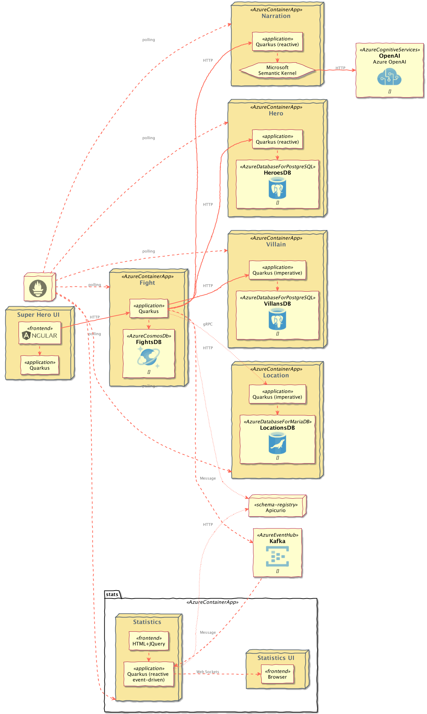
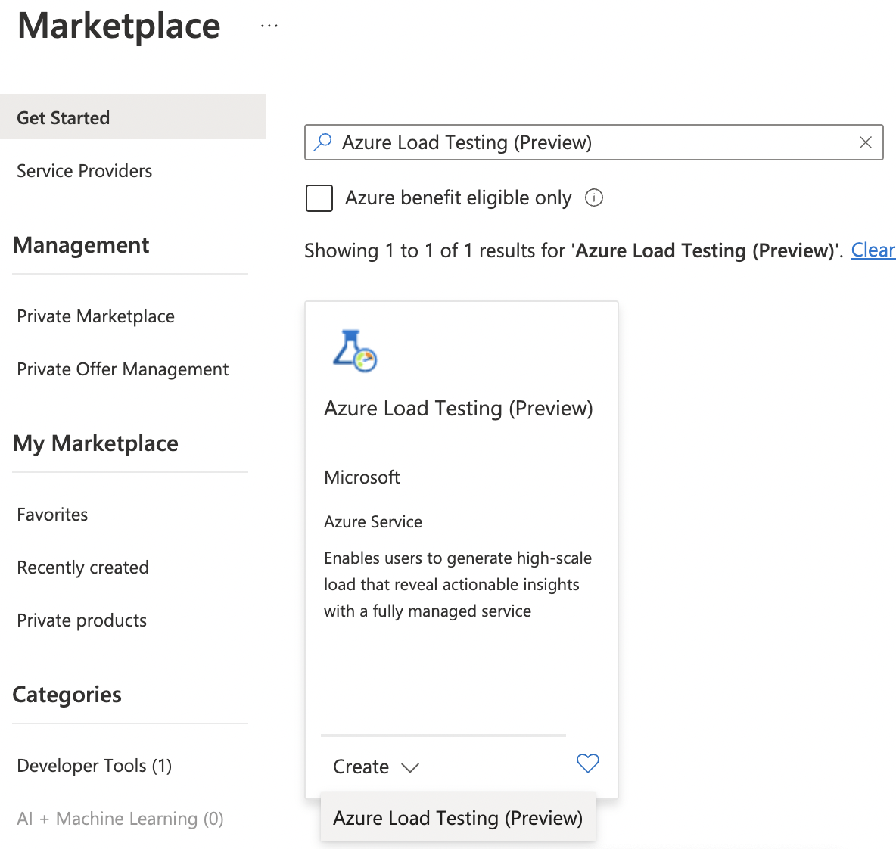
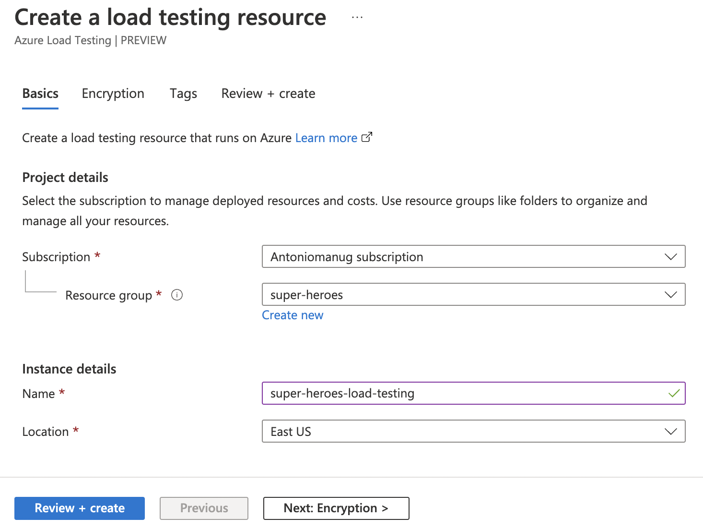
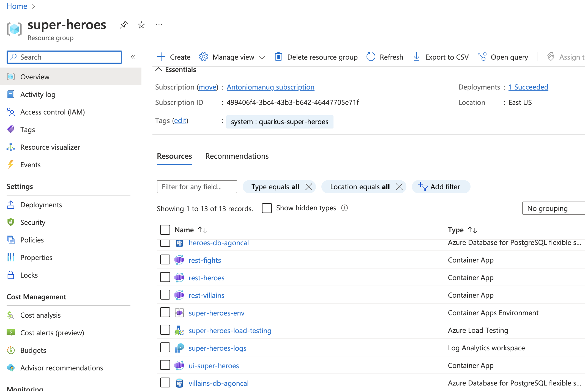
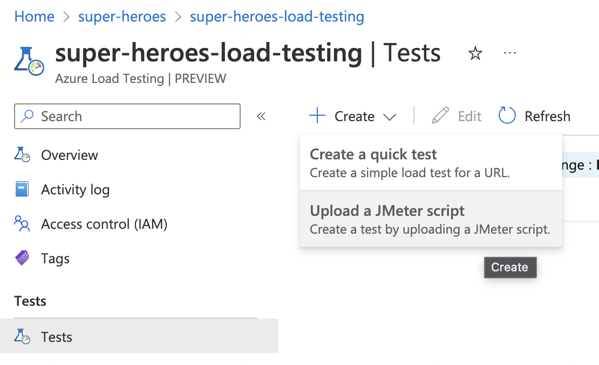
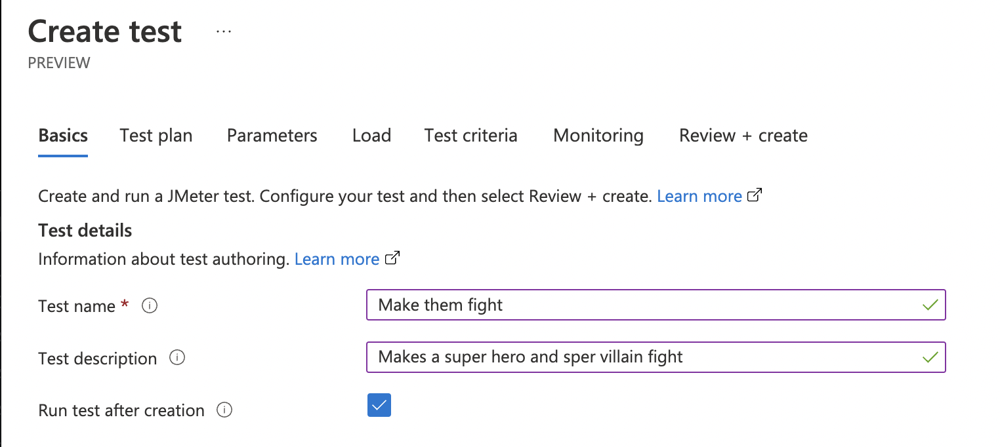
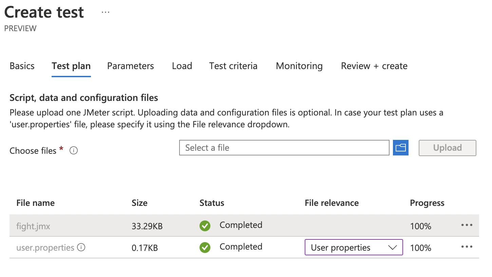
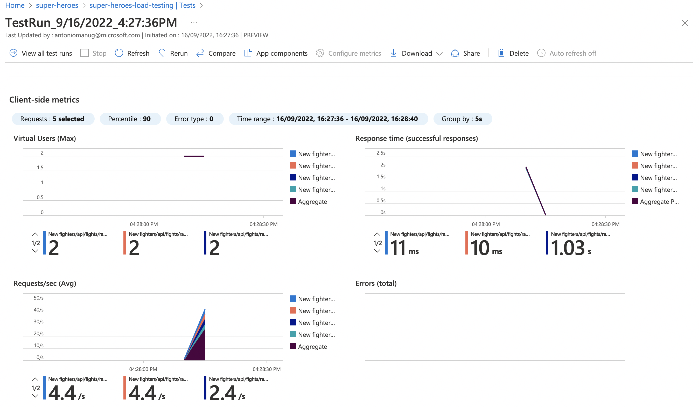
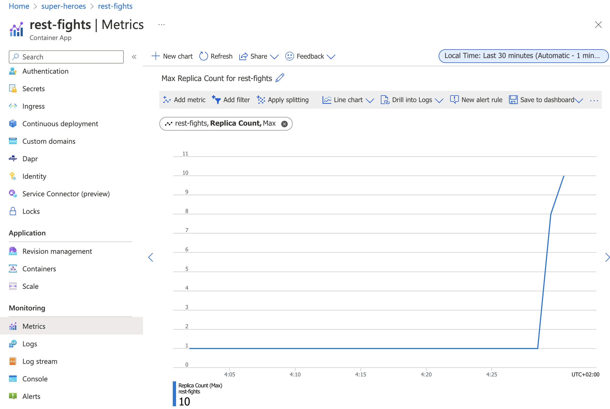

# Table of Contents
- [Introduction](#introduction)
- [Getting ready with Azure](#getting-ready-with-azure)
- [Automated Installation](#automated-installation)
- [Manual Installation](#manual-installation)
    - [Setting up the Azure environment](#setting-up-the-azure-environment)
    - [Create a resource group](#create-a-resource-group)
    - [Create a Container Apps environment](#create-a-container-apps-environment)
    - [Create the managed Postgres databases](#create-the-managed-postgres-databases)
    - [Create the managed MongoDB database](#create-the-managed-mongodb-database)
    - [Create the managed Kafka](#create-the-managed-kafka)
    - [Create the Schema Registry](#create-the-schema-registry)
    - [Deploying the applications](#deploying-the-applications)
        - [Heroes microservice](#heroes-microservice)
        - [Villains microservice](#villains-microservice)
        - [Statistics Microservice](#statistics-microservice)
        - [Fights microservice](#fights-microservice)
        - [Super Hero UI](#super-hero-ui)
- [Load Testing](#Load-testing)
- [Miscellaneous](#miscellaneous)
- [References](#references)

# Introduction
[Azure Container Apps](https://docs.microsoft.com/en-us/azure/container-apps/) allows to run containerized applications without worrying about orchestration or infrastructure (i.e. we don't have to directly use K8s, it's used under the hood).
This guide goes through setting up the Azure environment, the required services, and deploying the Super Hero application.
Some of these services (i.e. databases/Kafka/etc) have been replaced with managed Azure services.
This diagram shows the overall architecture:



# Getting ready with Azure

First of all, you need an Azure subscription.
If you don't have one, go to https://signup.azure.com and register.
Also make sure you have [Azure CLI installed](https://docs.microsoft.com/en-us/cli/azure/install-azure-cli) on your machine, as well as [curl](https://curl.se) and [jq](https://stedolan.github.io/jq).

Once everything is installed, sign in to Azure from the CLI:

```shell
az login
```

# Automated Installation

The entire system can be deployed in an automated fashion by running the [`deploy-to-azure-containerapps.sh` script](../scripts/deploy-to-azure-containerapps.sh).
This script can be downloaded and run outside of this repo as well.

Run `deploy-to-azure-containerapps.sh -h` for information and configuration options.

# Manual Installation

## Setting Up the Azure Environment

You only have to setup this once.
Install the Azure Container Apps and Database extensions for the Azure CLI:

```shell
az extension add --name containerapp
az extension add --name rdbms-connect
az extension add --name log-analytics
```

Register the Microsoft.App namespace

```shell
az provider register --namespace Microsoft.App --wait
```

Register the Microsoft.OperationalInsights provider

```shell
az provider register --namespace Microsoft.OperationalInsights --wait
```

## Setting Up the Environment Variables

The Super Heroes environment and application will be created and deployed using a set of Azure CLI commands.
For that, we need to set the following environment variables:

```shell
# Images
SUPERHEROES_IMAGES_BASE="quay.io/quarkus-super-heroes"
IMAGES_TAG="native-latest"

# Azure
RESOURCE_GROUP="super-heroes"
LOCATION="eastus2"
# Need this because some Azure services need to have unique names in a region
UNIQUE_IDENTIFIER=$(whoami)
TAG_SYSTEM=quarkus-super-heroes

# Container Apps
LOG_ANALYTICS_WORKSPACE="super-heroes-logs"
CONTAINERAPPS_ENVIRONMENT="super-heroes-env"

# Postgres
POSTGRES_DB_ADMIN="superheroesadmin"
POSTGRES_DB_PWD="p#ssw0rd-12046"
POSTGRES_DB_VERSION="14"
POSTGRES_SKU="B1ms"
POSTGRES_TIER="Burstable"

# MongoDB
MONGO_DB="fights-db-$UNIQUE_IDENTIFIER"
MONGO_DB_VERSION="4.2"

# Kafka
KAFKA_NAMESPACE="fights-kafka-$UNIQUE_IDENTIFIER"
KAFKA_TOPIC="fights"
KAFKA_BOOTSTRAP_SERVERS="$KAFKA_NAMESPACE.servicebus.windows.net:9093"

# Apicurio
APICURIO_APP="apicurio"
APICURIO_IMAGE="apicurio/apicurio-registry-mem:2.4.2.Final"

# Heroes
HEROES_APP="rest-heroes"
HEROES_DB="heroes-db-$UNIQUE_IDENTIFIER"
HEROES_IMAGE="${SUPERHEROES_IMAGES_BASE}/${HEROES_APP}:${IMAGES_TAG}"
HEROES_DB_SCHEMA="heroes"
HEROES_DB_CONNECT_STRING="postgresql://${HEROES_DB}.postgres.database.azure.com:5432/${HEROES_DB_SCHEMA}?ssl=true&sslmode=require"

# Villains
VILLAINS_APP="rest-villains"
VILLAINS_DB="villains-db-$UNIQUE_IDENTIFIER"
VILLAINS_IMAGE="${SUPERHEROES_IMAGES_BASE}/${VILLAINS_APP}:${IMAGES_TAG}"
VILLAINS_DB_SCHEMA="villains"
VILLAINS_DB_CONNECT_STRING="jdbc:otel:postgresql://${VILLAINS_DB}.postgres.database.azure.com:5432/${VILLAINS_DB_SCHEMA}?ssl=true&sslmode=require"

# Fights
FIGHTS_APP="rest-fights"
FIGHTS_DB_SCHEMA="fights"
FIGHTS_IMAGE="${SUPERHEROES_IMAGES_BASE}/${FIGHTS_APP}:${IMAGES_TAG}"

# Statistics
STATISTICS_APP="event-statistics"
STATISTICS_IMAGE="${SUPERHEROES_IMAGES_BASE}/${STATISTICS_APP}:${IMAGES_TAG}"

# UI
UI_APP="ui-super-heroes"
UI_IMAGE="${SUPERHEROES_IMAGES_BASE}/${UI_APP}:latest"
```

## Create a resource group

All the resources in Azure have to belong to a resource group.
Execute the following command to create a resource group:

```shell
az group create \
  --name "$RESOURCE_GROUP" \
  --location "$LOCATION" \
  --tags system="$TAG_SYSTEM"
```

## Create a Container Apps environment

Create a Log Analytics workspace:

```shell
az monitor log-analytics workspace create \
  --resource-group "$RESOURCE_GROUP" \
  --location "$LOCATION" \
  --tags system="$TAG_SYSTEM" \
  --workspace-name "$LOG_ANALYTICS_WORKSPACE"
```

Retrieve the Log Analytics Client ID and client secret:

```shell
LOG_ANALYTICS_WORKSPACE_CLIENT_ID=`az monitor log-analytics workspace show  \
  --resource-group "$RESOURCE_GROUP" \
  --workspace-name "$LOG_ANALYTICS_WORKSPACE" \
  --query customerId  \
  --output tsv | tr -d '[:space:]'`

echo $LOG_ANALYTICS_WORKSPACE_CLIENT_ID

LOG_ANALYTICS_WORKSPACE_CLIENT_SECRET=`az monitor log-analytics workspace get-shared-keys \
  --resource-group "$RESOURCE_GROUP" \
  --workspace-name "$LOG_ANALYTICS_WORKSPACE" \
  --query primarySharedKey \
  --output tsv | tr -d '[:space:]'`

echo $LOG_ANALYTICS_WORKSPACE_CLIENT_SECRET
```

A container apps environment acts as a boundary for our containers.
Containers deployed on the same environment use the same virtual network and the same Log Analytics workspace.
Create the container apps environment with the following command:

````shell
az containerapp env create \
  --resource-group "$RESOURCE_GROUP" \
  --location "$LOCATION" \
  --tags system="$TAG_SYSTEM" \
  --name "$CONTAINERAPPS_ENVIRONMENT" \
  --logs-workspace-id "$LOG_ANALYTICS_WORKSPACE_CLIENT_ID" \
  --logs-workspace-key "$LOG_ANALYTICS_WORKSPACE_CLIENT_SECRET"
````

## Create the managed Postgres Databases

We need to create two PostgreSQL databases so the Heroes and Villains microservice can store data.
Because we also want to access these database from external SQL client, we make them available to the outside world thanks to the `-public all` parameter.
Create the two databases with the following commands:

```shell
az postgres flexible-server create \
  --resource-group "$RESOURCE_GROUP" \
  --location "$LOCATION" \
  --tags system="$TAG_SYSTEM" application="$HEROES_APP" \
  --name "$HEROES_DB" \
  --admin-user "$POSTGRES_DB_ADMIN" \
  --admin-password "$POSTGRES_DB_PWD" \
  --public all \
  --sku-name "Standard_$POSTGRES_SKU" \
  --tier "$POSTGRES_TIER" \
  --storage-size 256 \
  --version "$POSTGRES_DB_VERSION"
```

```shell
az postgres flexible-server create \
  --resource-group "$RESOURCE_GROUP" \
  --location "$LOCATION" \
  --tags system="$TAG_SYSTEM" application="$VILLAINS_APP" \
  --name $VILLAINS_DB \
  --admin-user "$POSTGRES_DB_ADMIN" \
  --admin-password "$POSTGRES_DB_PWD" \
  --public all \
  --sku-name "Standard_$POSTGRES_SKU" \
  --tier "$POSTGRES_TIER" \
  --storage-size 256 \
  --version "$POSTGRES_DB_VERSION"
```

Then, we create two database schemas, one for Heroes, another one for Villains

```shell
az postgres flexible-server db create \
    --resource-group "$RESOURCE_GROUP" \
    --server-name "$HEROES_DB" \
    --database-name "$HEROES_DB_SCHEMA"
```

```shell
az postgres flexible-server db create \
    --resource-group "$RESOURCE_GROUP" \
    --server-name "$VILLAINS_DB" \
    --database-name "$VILLAINS_DB_SCHEMA"
```

Add data to both databases using the following commands:

```shell
az postgres flexible-server execute \
    --name "$HEROES_DB" \
    --admin-user "$POSTGRES_DB_ADMIN" \
    --admin-password "$POSTGRES_DB_PWD" \
    --database-name "$HEROES_DB_SCHEMA" \
    --file-path "rest-heroes/deploy/db-init/initialize-tables.sql"
```

```shell
az postgres flexible-server execute \
    --name "$VILLAINS_DB" \
    --admin-user "$POSTGRES_DB_ADMIN" \
    --admin-password "$POSTGRES_DB_PWD" \
    --database-name "$VILLAINS_DB_SCHEMA" \
    --file-path "rest-villains/deploy/db-init/initialize-tables.sql"
```

You can check the content of the tables with the following commands:

```shell
az postgres flexible-server execute \
    --name "$HEROES_DB" \
    --admin-user "$POSTGRES_DB_ADMIN" \
    --admin-password "$POSTGRES_DB_PWD" \
    --database-name "$HEROES_DB_SCHEMA" \
    --querytext "select * from hero"
```

```shell
az postgres flexible-server execute \
    --name "$VILLAINS_DB" \
    --admin-user "$POSTGRES_DB_ADMIN" \
    --admin-password "$POSTGRES_DB_PWD" \
    --database-name "$VILLAINS_DB_SCHEMA" \
    --querytext "select * from villain"
```

If you'd like to see the connection strings to the databases (so you can access your database from an external SQL client), use the following commands:

```shell
az postgres flexible-server show-connection-string \
  --database-name "$HEROES_DB_SCHEMA" \
  --server-name "$HEROES_DB" \
  --admin-user "$POSTGRES_DB_ADMIN" \
  --admin-password "$POSTGRES_DB_PWD" \
  --query "connectionStrings.jdbc" \
  --output tsv

az postgres flexible-server show-connection-string \
  --database-name "$VILLAINS_DB_SCHEMA" \
  --server-name "$VILLAINS_DB" \
  --admin-user "$POSTGRES_DB_ADMIN" \
  --admin-password "$POSTGRES_DB_PWD" \
  --query "connectionStrings.jdbc" \
  --output tsv
```

> **NOTE:** These aren't the actual connection strings used, especially in the heroes service, which does not use JDBC.
> 
> You also need to append `ssl=true&sslmode=require` to the end of each connect string to force the driver to use ssl.
> 
> These commands are just here for your own examination purposes.

## Create the managed MongoDB Database

We need to create a MongoDB so the Fight microservice can store data.
Create a database in the region where it's available:

```shell
az cosmosdb create \
  --resource "$RESOURCE_GROUP" \
  --locations regionName="$LOCATION" failoverPriority=0 \
  --tags system="$TAG_SYSTEM" application="$FIGHTS_APP" \
  --name "$MONGO_DB" \
  --kind MongoDB \
  --server-version "$MONGO_DB_VERSION"
```

Create the Fight collection:

````shell
az cosmosdb mongodb database create \
  --resource-group "$RESOURCE_GROUP" \
  --account-name "$MONGO_DB" \
  --name "$FIGHTS_DB_SCHEMA"
````

To configure the Fight microservice we will need to set the MongoDB connection string.
To get this connection string use the following command:

```shell
MONGO_CONNECTION_STRING=$(az cosmosdb keys list \
  --resource-group "$RESOURCE_GROUP" \
  --name "$MONGO_DB" \
  --type connection-strings \
  --query "connectionStrings[?description=='Primary MongoDB Connection String'].connectionString" \
  --output tsv)

echo $MONGO_CONNECTION_STRING
```

## Create the Managed Kafka

The Fight microservice communicates with the Statistics microservice through Kafka.
We need to create an Azure event hub for that.

```shell
az eventhubs namespace create \
  --resource-group "$RESOURCE_GROUP" \
  --location "$LOCATION" \
  --tags system="$TAG_SYSTEM" application="$FIGHTS_APP" \
  --name "$KAFKA_NAMESPACE"
```

Then, create the Kafka topic where the messages will be sent to and consumed from:

```shell
az eventhubs eventhub create \
  --resource-group "$RESOURCE_GROUP" \
  --name "$KAFKA_TOPIC" \
  --namespace-name "$KAFKA_NAMESPACE"
```

To configure Kafka in the Fight and Statistics microservices, get the connection string with the following commands:

```shell
KAFKA_CONNECTION_STRING=$(az eventhubs namespace authorization-rule keys list \
  --resource-group "$RESOURCE_GROUP" \
  --namespace-name "$KAFKA_NAMESPACE" \
  --name RootManageSharedAccessKey \
  --output json | jq -r .primaryConnectionString)
  
JAAS_CONFIG='org.apache.kafka.common.security.plain.PlainLoginModule required username="$ConnectionString" password="'
KAFKA_JAAS_CONFIG="${JAAS_CONFIG}${KAFKA_CONNECTION_STRING}\";"

echo $KAFKA_CONNECTION_STRING
echo $KAFKA_JAAS_CONFIG
```

## Create the Schema Registry

Messages sent and consumed from Kafka need to be validated against a schema.
These schemas are deployed to Apicurio.
Notice the `--min-replicas 1` so Apicurio does not scale to 0 and is always available:

```shell
az containerapp create \
  --resource-group "$RESOURCE_GROUP" \
  --tags system="$TAG_SYSTEM" application="$FIGHTS_APP" \
  --image "$APICURIO_IMAGE" \
  --name "$APICURIO_APP" \
  --environment "$CONTAINERAPPS_ENVIRONMENT" \
  --ingress external \
  --target-port 8080 \
  --min-replicas 1 \
  --env-vars REGISTRY_AUTH_ANONYMOUS_READ_ACCESS_ENABLED=true
```

Get the Apicurio URL with the following command:

```shell
APICURIO_URL="https://$(az containerapp ingress show \
    --resource-group "$RESOURCE_GROUP" \
    --name "$APICURIO_APP" \
    --output json | jq -r .fqdn)"
  
echo $APICURIO_URL  
```

And then, update the Apicurio container with these new variables:

```shell
az containerapp update \
  --resource-group "$RESOURCE_GROUP" \
  --name "$APICURIO_APP" \
  --set-env-vars REGISTRY_UI_CONFIG_APIURL="${APICURIO_URL}/apis/registry" \
                 REGISTRY_UI_CONFIG_UIURL="${APICURIO_URL}/ui"
```

You can go to the Apicurio web console:

```shell
open $APICURIO_URL
```

## Deploying the Applications

Now that the Azure Container Apps environment is all set, we need to deploy our microservices to Azure Container Apps.
So let's create an instance of Container Apps for each of our microservices and User Interface.

### Heroes Microservice

The Heroes microservice needs to access the managed Postgres database.
Therefore, we need to set the right properties using our environment variables.
Notice that the Heroes microservice has a `--min-replicas` set to 0.
That means it can scale down to zero if not used.

```shell
az containerapp create \
  --resource-group "$RESOURCE_GROUP" \
  --tags system="$TAG_SYSTEM" application="$HEROES_APP" \
  --image "$HEROES_IMAGE" \
  --name "$HEROES_APP" \
  --environment "$CONTAINERAPPS_ENVIRONMENT" \
  --ingress external \
  --target-port 8083 \
  --min-replicas 0 \
  --env-vars QUARKUS_HIBERNATE_ORM_DATABASE_GENERATION=validate \
             QUARKUS_HIBERNATE_ORM_SQL_LOAD_SCRIPT=no-file \
             QUARKUS_DATASOURCE_USERNAME="$POSTGRES_DB_ADMIN" \
             QUARKUS_DATASOURCE_PASSWORD="$POSTGRES_DB_PWD" \
             QUARKUS_DATASOURCE_REACTIVE_URL="$HEROES_DB_CONNECT_STRING"
```

The following command sets the URL of the deployed application to the `HEROES_URL` variable:

```shell
HEROES_URL="https://$(az containerapp ingress show \
    --resource-group $RESOURCE_GROUP \
    --name $HEROES_APP \
    --output json | jq -r .fqdn)"
    
echo $HEROES_URL
```
You can now invoke the Hero microservice APIs with:

```shell
curl "$HEROES_URL/api/heroes/hello"
curl "$HEROES_URL/api/heroes" | jq
```

To access the logs of the Heroes microservice, you can write the following query:

```shell
az containerapp logs show \
  --name "$HEROES_APP" \
  --resource-group "$RESOURCE_GROUP" \
  --output table
```

### Villains Microservice

The Villain microservice also needs to access the managed Postgres database, so we need to set the right variables.
Notice the minimum of replicas is also set to 0:

```shell
az containerapp create \
  --resource-group "$RESOURCE_GROUP" \
  --tags system="$TAG_SYSTEM" application="$VILLAINS_APP" \
  --image "$VILLAINS_IMAGE" \
  --name "$VILLAINS_APP" \
  --environment "$CONTAINERAPPS_ENVIRONMENT" \
  --ingress external \
  --target-port 8084 \
  --min-replicas 0 \
  --env-vars QUARKUS_HIBERNATE_ORM_DATABASE_GENERATION=validate \
             QUARKUS_HIBERNATE_ORM_SQL_LOAD_SCRIPT=no-file \
             QUARKUS_DATASOURCE_USERNAME="$POSTGRES_DB_ADMIN" \
             QUARKUS_DATASOURCE_PASSWORD="$POSTGRES_DB_PWD" \
             QUARKUS_DATASOURCE_JDBC_URL="$VILLAINS_DB_CONNECT_STRING"
```

The following command sets the URL of the deployed application to the `VILLAINS_URL` variable:

```shell
VILLAINS_URL="https://$(az containerapp ingress show \
    --resource-group $RESOURCE_GROUP \
    --name $VILLAINS_APP \
    --output json | jq -r .fqdn)"
  
echo $VILLAINS_URL
```
You can now invoke the Hero microservice APIs with:

```shell
curl "$VILLAINS_URL/api/villains/hello"
curl "$VILLAINS_URL/api/villains" | jq
```

To access the logs of the Villain microservice, you can write the following query:

````shell
az containerapp logs show \
  --name "$VILLAINS_APP" \
  --resource-group "$RESOURCE_GROUP" \
  --output table
````

### Statistics Microservice

The Statistics microservice listens to a Kafka topics and consumes all the fights.
The fight messages are defined by an Avro schema stored in Apicurio (`APICURIO_URL` and we append `/apis/registry/v2`):.
Notice that we use the value of the `$$KAFKA_JAAS_CONFIG` in the `password`.

```shell
az containerapp create \
  --resource-group "$RESOURCE_GROUP" \
  --tags system="$TAG_SYSTEM" application="$STATISTICS_APP" \
  --image "$STATISTICS_IMAGE" \
  --name "$STATISTICS_APP" \
  --environment "$CONTAINERAPPS_ENVIRONMENT" \
  --ingress external \
  --target-port 8085 \
  --min-replicas 0 \
  --env-vars KAFKA_BOOTSTRAP_SERVERS="$KAFKA_BOOTSTRAP_SERVERS" \
             KAFKA_SECURITY_PROTOCOL=SASL_SSL \
             KAFKA_SASL_MECHANISM=PLAIN \
             KAFKA_SASL_JAAS_CONFIG="$KAFKA_JAAS_CONFIG" \
             MP_MESSAGING_CONNECTOR_SMALLRYE_KAFKA_APICURIO_REGISTRY_URL="${APICURIO_URL}/apis/registry/v2"
```

The following command sets the URL of the deployed application to the `STATISTICS_URL` variable:


```shell
STATISTICS_URL="https://$(az containerapp ingress show \
    --resource-group $RESOURCE_GROUP \
    --name $STATISTICS_APP \
    --output json | jq -r .fqdn)"

echo $STATISTICS_URL  
```

You can now display the Statistics UI with:

```shell
open "$STATISTICS_URL"
```

To access the logs of the Statistics microservice, you can write the following query:

```shell
az containerapp logs show \
  --name "$STATISTICS_APP" \
  --resource-group "$RESOURCE_GROUP" \
  --output table
```

### Fights Microservice

The Fight microservice invokes the Heroes and Villains microserivces, sends fight messages to a Kafka topics and stores the fights into a MongoDB database.
We need to configure Kafka (same connection string as the one used by the Statistics microservice) as well as Mongo and Apicurio (variable `APICURIO_URL` and append `apis/registry/v2`).
As for the microservice invocations, you need to set the URLs of both Heroes and Villains microservices.

```shell
az containerapp create \
  --resource-group "$RESOURCE_GROUP" \
  --tags system="$TAG_SYSTEM" application="$FIGHTS_APP" \
  --image "$FIGHTS_IMAGE" \
  --name "$FIGHTS_APP" \
  --environment "$CONTAINERAPPS_ENVIRONMENT" \
  --ingress external \
  --target-port 8082 \
  --min-replicas 1 \
  --env-vars KAFKA_BOOTSTRAP_SERVERS="$KAFKA_BOOTSTRAP_SERVERS" \
             KAFKA_SECURITY_PROTOCOL=SASL_SSL \
             KAFKA_SASL_MECHANISM=PLAIN \
             KAFKA_SASL_JAAS_CONFIG="$KAFKA_JAAS_CONFIG" \
             MP_MESSAGING_CONNECTOR_SMALLRYE_KAFKA_APICURIO_REGISTRY_URL="${APICURIO_URL}/apis/registry/v2" \
             QUARKUS_LIQUIBASE_MONGODB_MIGRATE_AT_START=false \
             QUARKUS_MONGODB_CONNECTION_STRING="$MONGO_CONNECTION_STRING" \
             QUARKUS_REST_CLIENT_HERO_CLIENT_URL="$HEROES_URL" \
             FIGHT_VILLAIN_CLIENT_BASE_URL="$VILLAINS_URL"
```

The following command sets the URL of the deployed application to the `FIGHTS_URL` variable:

```shell
FIGHTS_URL="https://$(az containerapp ingress show \
    --resource-group $RESOURCE_GROUP \
    --name $FIGHTS_APP \
    --output json | jq -r .fqdn)"

echo $FIGHTS_URL
```

Use the following curl commands to access the Fight microservice.
Remember that we've set the minimum replicas to 0.
That means that pinging the Hero and Villain microservices might fallback (you will get a _That means that pinging the Hero and Villain microservices might fallback (you will get a That means that pinging the Hero and Villain microservices might fallback (you will get a _Could not invoke the Villains microservice_ message).
Execute several times the same curl commands so Azure Containers Apps has time to instantiate one replica and process the requests: 

```shell
curl "$FIGHTS_URL/api/fights/hello"
curl "$FIGHTS_URL/api/fights/hello/villains"
curl "$FIGHTS_URL/api/fights/hello/heroes"
curl "$FIGHTS_URL/api/fights" | jq
curl "$FIGHTS_URL/api/fights/randomfighters" | jq
```

To access the logs of the Fight microservice, you can write the following query:

```shell
az containerapp logs show \
  --name "$FIGHTS_APP" \
  --resource-group "$RESOURCE_GROUP" \
  --output table
```

### Super Hero UI

We can deploy the Super Hero UI in two different ways:

* Using Azure Container Apps and deploying the Docker image as we did for the previous microservices
* Using Azure Static Webapps witch is suited for Angular applications

#### Super Hero UI (using Azure Container Apps)

```shell
az containerapp create \
  --resource-group "$RESOURCE_GROUP" \
  --tags system="$TAG_SYSTEM" application="$UI_APP" \
  --image "$UI_IMAGE" \
  --name "$UI_APP" \
  --environment "$CONTAINERAPPS_ENVIRONMENT" \
  --ingress external \
  --target-port 8080 \
  --env-vars API_BASE_URL="$FIGHTS_URL"
```

```shell
UI_URL="https://$(az containerapp ingress show \
    --resource-group $RESOURCE_GROUP \
    --name $UI_APP \
    --output json | jq -r .fqdn)"
  
echo $UI_URL  
```

```shell
open "$UI_URL"
```

#### Super Hero UI (optional using Azure Static Webapps)

If you are building the UI locally with Node 17 you have to set the `NODE_OPTIONS` variable:

```shell
node version
export NODE_OPTIONS=--openssl-legacy-provider
```

Then, to execute the app locally, set `API_BASE_URL` with the same value of the Fight microservice URL (so it accesses the remote Fight microservice): 

```shell
export API_BASE_URL=https://${FIGHT_URL}/api
ui-super-heroes$ java -jar target/quarkus-app/quarkus-run.jar
```

You can check the URL is correctly set with:

```shell
curl http://localhost:8080/env.js
```

Then, we will deploy the Angular application using [Azure Static Webapps](https://azure.microsoft.com/en-us/services/app-service/static).
This creates a GitHub action and deploys the application each time you push the code:

```shell
az staticwebapp create \
  --resource-group $RESOURCE_GROUP \
  --location $LOCATION \
  --name $UI_APP \
  --source https://github.com/agoncal/quarkus-super-heroes \
  --branch azure \
  --app-location /ui-super-heroes \
  --login-with-github
```

If you have an issue with secrets, you can list the secrets that exist for the static web app:

```shell
az staticwebapp secrets list  \
  --resource-group $RESOURCE_GROUP \
  --name $UI_APP \
  --output table
```

# Load Testing

Now time to add some load to the application.
This way, we will be able to see the auto-scaling in Azure Container Apps.

To add some load to an application, you can do it locally using [JMeter](https://jmeter.apache.org), but you can also do it remotely on Azure using [Azure Load Testing](https://azure.microsoft.com/services/load-testing) and JMeter.
Azure Load Testing is a fully managed load-testing service built for Azure that makes it easy to generate high-scale load and identify app performance bottlenecks.
It is available on the [Azure Marketplace](https://azuremarketplace.microsoft.com).
For that, we need to go the 

To use Azure Load Testing, go to the [Azure Portal](https://portal.azure.com), search for the Marketplace and look for "_Azure Load Testing_"  in the Marketplace.
Click on "_Create_":



Create a load testing resource by giving it a unique name (eg. `super-heroes-load-testing` with your id), a location, and a resource group.
Click on "Create":



Creating a load testing resource can take a few moment.
Once created, you should see the Azure Load Testing available in your resource group: 



Select `super-heroes-load-testing` and click on "_Tests_" and then "Create".
You can either create a quick load test using a wizard, or create a load test using a JMeter script.
Choose this second option:



Before uploading a JMeter script, create a load test by entering a name (eg. "_Make them fight_"), a description and click "_Next: Test plan >_: 



The JMeter file that will upload (located under `scripts/jmeter/src/test/jmeter/fight.jmx`) sets up a load campaign targeting the "Fight" microservice.
Basically, it will invoke the `FightResource` endpoint so super heroes and super villains will fight.
Before uploading the `user.properties` file, make sure you change the properties so you target the `FightResource` endpoint URL:

```properties
# Change these numbers depending on the load you want to add to the application
LOOPS=20
THREADS=2
RAMP=1

# Azure
FIGHT_PROTOCOL=https
FIGHT_PORT=443
# Change the host depending on your settings
FIGHT_HOST=rest-fights.kindocean-1cba89db.eastus.azurecontainerapps.io
```

Now, go to the "_Test plan_" menu, and upload the JMeter file `fight.jmx`
Then, upload the `user.properties` file (select "_User properties_" under "_File Relevance_").



Execute the test and you will get some metrics:



Go back to the resource group of your Azure portal and select the `rest-fights` app.
Click on "_Metrics_".
Add the "_Replica Count_" metric to the dashboard.
You will notice that the number of replicas have increased from 1 replica to 10.
Azure Container Apps has scaled automatically the application depending on the load.



# Miscellaneous

## Restarting a Microservice

If you need to restart a microservice, you need to actually restart the active revision.
For that, first get the active revision:

```shell
az containerapp revision list \
  --resource-group $RESOURCE_GROUP \
  --name $FIGHTS_APP \
  --output table
```

Then, restart it:

```shell
az containerapp revision restart \
  --resource-group $RESOURCE_GROUP \
  --app $FIGHTS_APP \
  --name rest-fights-app--mh396rg
```

## Redeploying a new version of a microservice

If you need to push a new version of a Docker image, make sure it has a different tag.
Then, update the container with this new tagged image:

```shell
az containerapp update \
  --resource-group $RESOURCE_GROUP \
  --image quay.io/quarkus-super-heroes/rest-fights:azure2 \
  --name $FIGHTS_APP
```

```shell
az containerapp update \
  --resource-group $RESOURCE_GROUP \
  --name $APICURIO_APP \
  --set-env-vars QUARKUS_LOG_LEVEL=DEBUG
```

# References

* [Azure Container Apps Overview](https://azure.microsoft.com/en-us/services/container-apps/#overview)
* [Azure Container Apps Documentation](https://docs.microsoft.com/en-us/azure/container-apps/overview)
* [Quarkus on Azure Container Apps using Dapr](https://github-com.translate.goog/yoshioterada/Quarkus-run-on-Azure-Container-Apps-with-Dapr?_x_tr_sl=ja&_x_tr_tl=en&_x_tr_hl=ja&_x_tr_pto=wapp)
* [Managed Kafka Quarkus](https://github.com/ozangunalp/managed-kafka-quarkus/tree/main/azure-event-hub)
