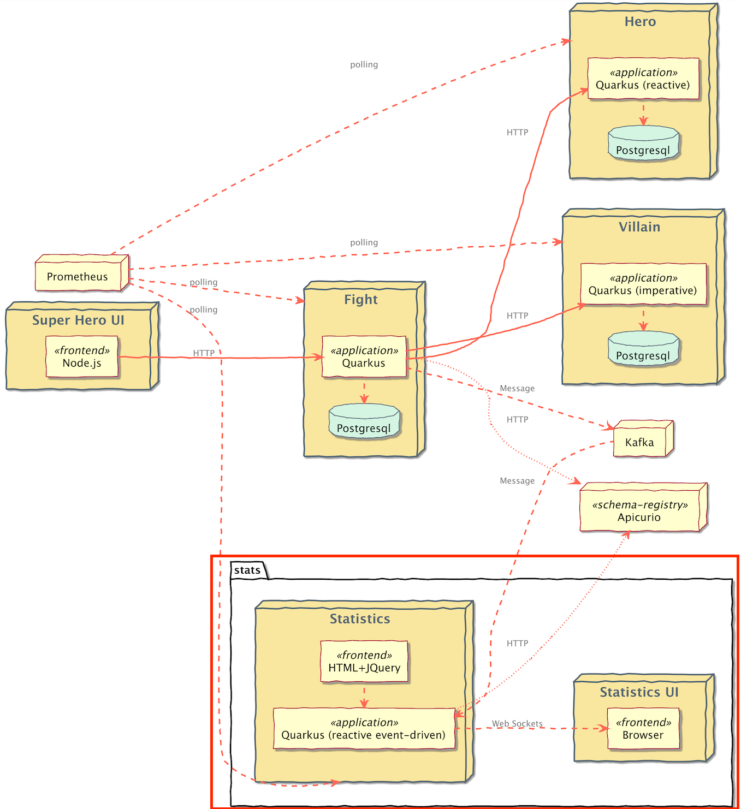
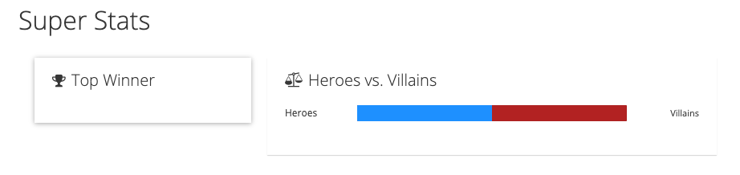

# Superheroes Event Statistics Microservice

## Table of Contents
- [Introduction](#introduction)
    - [Team Stats](#team-stats)
    - [Winner Stats](#winner-stats)
- [Testing](#testing) 
- [Running the Application](#running-the-application)
- [Running Locally via Docker Compose](#running-locally-via-docker-compose)
- [Deploying to Kubernetes](#deploying-to-kubernetes)

## Introduction
This is the event statistics microservice. It is an event-driven microservice, listening for fight event messages on an [Apache Kafka](https://kafka.apache.org/) topic utilizing [SmallRye Reactive Messaging](https://quarkus.io/guides/kafka).



Messages arrive on the `fights` topic. The [`SuperStats`](src/main/java/io/quarkus/sample/superheroes/statistics/listener/SuperStats.java) class listens to these events and keeps track of 2 kinds of statistics: _team_ stats and _winner_ stats.

This service also has its own UI where you can see the top winners and the percentage of hero victories!



### Team Stats
Team stats are accumulated by the number of wins by heroes vs villains. It is calculated as a percentage of hero wins to villain wins.

Team stats are then sent over the `/stats/team` [WebSocket](https://en.wikipedia.org/wiki/WebSocket) by the [`TeamStatsWebSocket`](src/main/java/io/quarkus/sample/superheroes/statistics/endpoint/TeamStatsWebSocket.java) WebSocket class. Every time a new fight event is received, the team stats are re-computed and the new hero-to-winner percentage is emitted to anyone listening on the WebSocket.

### Winner Stats
Winner stats are accumulated by the number of wins of each hero or villain.

Winner stats are then sent over the `/stats/winners` [WebSocket](https://en.wikipedia.org/wiki/WebSocket) by the [`TopWinnerWebSocket`](src/main/java/io/quarkus/sample/superheroes/statistics/endpoint/TopWinnerWebSocket.java) WebSocket class. Every time a new fight event is received, the winner stats are re-computed and a JSON array containing all the winners and the number of wins for each winner is emitted to anyone listening on the WebSocket.

A sample payload might look like this:

```json
[
    {
        "name": "Chewbacca",
        "score": 5
    },
    {
        "nane": "Darth Vader",
        "score": 3
    },
    {
        "name": "Yoda",
        "score": 10
    }
]
```

## Testing
This application has a full suite of tests, including an integration test suite ([`TeamStatsWebSocketIT`](src/test/java/io/quarkus/sample/superheroes/statistics/endpoint/TeamStatsWebSocketIT.java) and [`TopWinnerWebSocketIT`](src/test/java/io/quarkus/sample/superheroes/statistics/endpoint/TopWinnerWebSocketIT.java)). The integration test suite uses [Quarkus Dev Services](https://quarkus.io/guides/getting-started-testing#testing-dev-services) (see [`KafkaProducerResource`](src/test/java/io/quarkus/sample/superheroes/statistics/KafkaProducerResource.java)) to interact with a Kafka instance. Integration tests can inject a `KafkaProducer` to place messages on the topic and then listen on the WebSockets to verify stats were correctly computed.

## Running the Application
The application runs on port `8085` (defined by `quarkus.http.port` in [`application.properties`](src/main/resources/application.properties)).

From the `quarkus-super-heroes/event-statistics` directory, simply run `./mvnw quarkus:dev` to run [Quarkus Dev Mode](https://quarkus.io/guides/maven-tooling#dev-mode), or running `quarkus dev` using the [Quarkus CLI](https://quarkus.io/guides/cli-tooling). The application's UI will be exposed at http://localhost:8085 and the [Quarkus Dev UI](https://quarkus.io/guides/dev-ui) will be exposed at http://localhost:8085/q/dev. 

**NOTE:** Running the application outside of Quarkus dev mode requires standing up an Apache Kafka instance and binding it to the app.

By default, the application is configured with the following:

| Description             | Environment Variable      | Java Property             | Value                        |
|-------------------------|---------------------------|---------------------------|------------------------------|
| Kafka Bootstrap servers | `KAFKA_BOOTSTRAP_SERVERS` | `kafka.bootstrap.servers` | `PLAINTEXT://localhost:9092` |

## Running Locally via Docker Compose
Pre-built images for this application can be found at [`quay.io/quarkus-super-heroes/event-statistics`](https://quay.io/repository/quarkus-super-heroes/event-statistics?tab=tags). 

Pick one of the 4 versions of the application from the table below and execute the appropriate docker compose command from the `quarkus-super-heroes/event-statistics` directory.

   > **NOTE**: You may see errors as the applications start up. This may happen if an application completes startup before one if its required services (i.e. database, kafka, etc). This is fine. Once everything completes startup things will work fine.

| Description                  | Image Tag              | Docker Compose Run Command                                                      |
|------------------------------|------------------------|---------------------------------------------------------------------------------|
| JVM Java 11                  | `java11-latest`        | `docker-compose -f deploy/docker-compose/java11.yml up --remove-orphans`        |
| JVM Java 17                  | `java17-latest`        | `docker-compose -f deploy/docker-compose/java17.yml up --remove-orphans`        |
| Native compiled with Java 11 | `native-java11-latest` | `docker-compose -f deploy/docker-compose/native-java11.yml up --remove-orphans` |
| Native compiled with Java 17 | `native-java17-latest` | `docker-compose -f deploy/docker-compose/native-java17.yml up --remove-orphans` |

These Docker Compose files are meant for standing up this application and the required Kafka broker only. If you want to stand up the entire system, [follow these instructions](../README.md#running-locally-via-docker-compose).

Once started the application will be exposed at `http://localhost:8082`.

## Deploying to Kubernetes
Pre-built images for this application can be found at [`quay.io/quarkus-super-heroes/event-statistics`](https://quay.io/repository/quarkus-super-heroes/event-statistics?tab=tags).

Deployment descriptors for these images are provided in the [`deploy/k8s`](deploy/k8s) directory. There are versions for [OpenShift](https://www.openshift.com), [Minikube](https://quarkus.io/guides/deploying-to-kubernetes#deploying-to-minikube), and [Kubernetes](https://www.kubernetes.io).

Pick one of the 4 versions of the application from the table below and deploy the appropriate descriptor from the [`deploy/k8s` directory](deploy/k8s).

| Description                  | Image Tag              | OpenShift Descriptor                                                    | Minikube Descriptor                                                   | Kubernetes Descriptor                                                     |
|------------------------------|------------------------|-------------------------------------------------------------------------|-----------------------------------------------------------------------|---------------------------------------------------------------------------|
| JVM Java 11                  | `java11-latest`        | [`java11-openshift.yml`](deploy/k8s/java11-openshift.yml)               | [`java11-minikube.yml`](deploy/k8s/java11-minikube.yml)               | [`java11-kubernetes.yml`](deploy/k8s/java11-kubernetes.yml)               |
| JVM Java 17                  | `java17-latest`        | [`java17-openshift.yml`](deploy/k8s/java17-openshift.yml)               | [`java17-minikube.yml`](deploy/k8s/java17-minikube.yml)               | [`java17-kubernetes.yml`](deploy/k8s/java17-kubernetes.yml)               |
| Native compiled with Java 11 | `native-java11-latest` | [`native-java11-openshift.yml`](deploy/k8s/native-java11-openshift.yml) | [`native-java11-minikube.yml`](deploy/k8s/native-java11-minikube.yml) | [`native-java11-kubernetes.yml`](deploy/k8s/native-java11-kubernetes.yml) |
| Native compiled with Java 17 | `native-java17-latest` | [`native-java17-openshift.yml`](deploy/k8s/native-java17-openshift.yml) | [`native-java17-minikube.yml`](deploy/k8s/native-java17-minikube.yml) | [`native-java17-kubernetes.yml`](deploy/k8s/native-java17-kubernetes.yml) |

The application is exposed outside of the cluster on port `80`.

These are only the descriptors for this application and the required Kafka broker only. If you want to deploy the entire system, [follow these instructions](../README.md#deploying-to-kubernetes).
