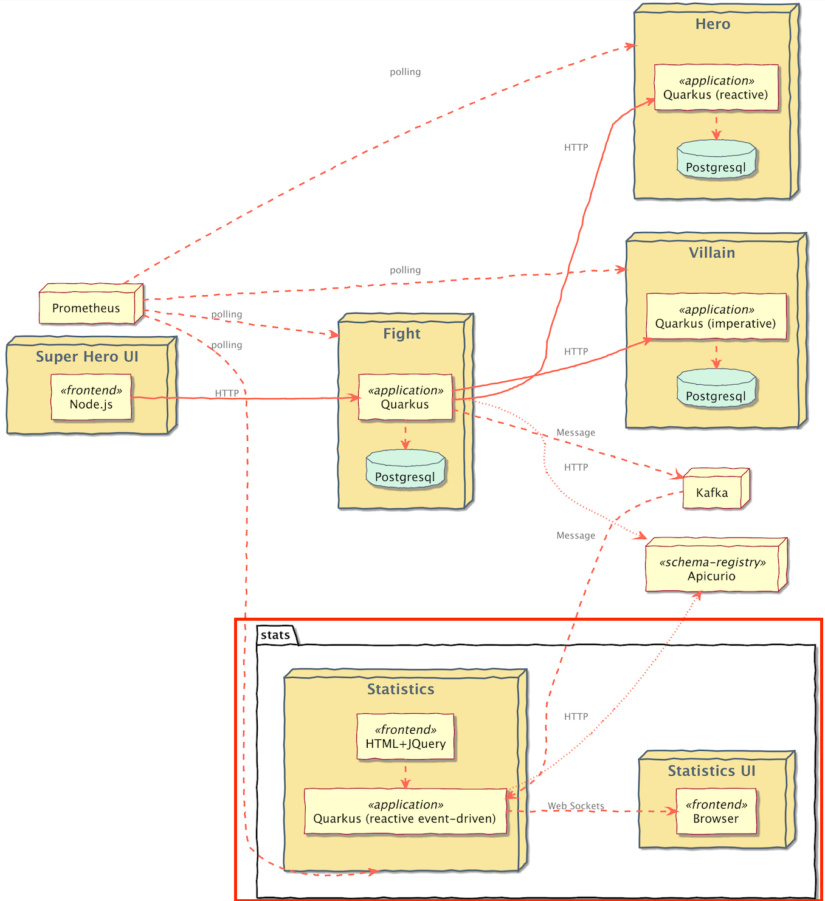
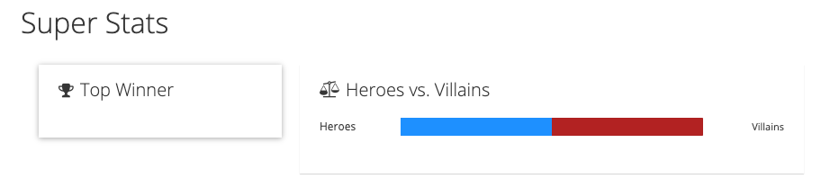

# Superheroes Event Statistics Microservice

> **Full documentation: [https://quarkus.io/quarkus-super-heroes/event-statistics](https://quarkus.io/quarkus-super-heroes/event-statistics)**

## Introduction

This is the event statistics microservice. It is an event-driven microservice, listening for fight event messages on an [Apache Kafka](https://kafka.apache.org/) topic utilizing [SmallRye Reactive Messaging](https://quarkus.io/guides/kafka).

Messages arrive on the `fights` topic. The service keeps track of team stats (hero wins vs villain wins) and winner stats (per-fighter win counts), which are served to the UI via [WebSockets](https://en.wikipedia.org/wiki/WebSocket).

## Running the Application

The application runs on port `8085` (defined by `quarkus.http.port` in [`application.properties`](src/main/resources/application.properties)).

From the `quarkus-super-heroes/event-statistics` directory, simply run `./mvnw quarkus:dev` to run [Quarkus Dev Mode](https://quarkus.io/guides/maven-tooling#dev-mode). The application's UI will be exposed at `http://localhost:8085` and the [Quarkus Dev UI](https://quarkus.io/guides/dev-ui) will be exposed at `http://localhost:8085/q/dev`.

