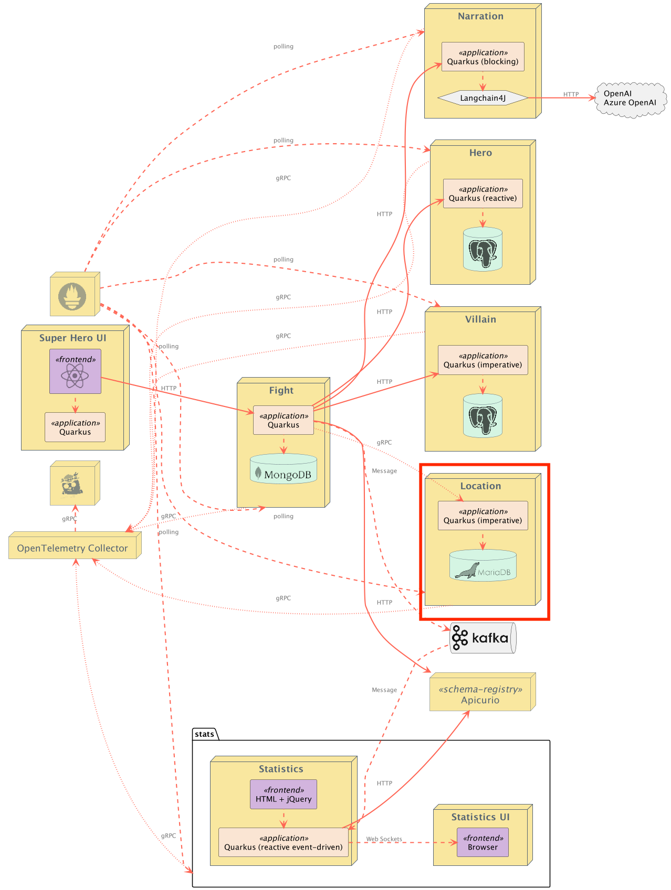

# Superheroes Location Microservice

## Table of Contents
- [Introduction](#introduction)
    - [Exposed Endpoints](#exposed-endpoints) 
- [Benchmarking with Hyperfoil](#benchmarking-with-hyperfoil)
- [Running the Application](#running-the-application)
- [Running Locally via Docker Compose](#running-locally-via-docker-compose)
- [Deploying to Kubernetes](#deploying-to-kubernetes)
    - [Using pre-built images](#using-pre-built-images)
    - [Deploying directly via Kubernetes Extensions](#deploying-directly-via-kubernetes-extensions)

## Introduction
This is the Location gRPC microservice. It is a classical gRPC microservice, written in [Kotlin](https://quarkus.io/guides/kotlin), and exposing CRUD operations on Locations. Location information is stored in a MariaDB database. This service is implemented using [gRPC](https://quarkus.io/guides/grpc-service-implementation) with blocking endpoints and [Quarkus Hibernate ORM with Panache's repository pattern](https://quarkus.io/guides/hibernate-orm-panache-kotlin#using-the-repository-pattern).

Additionally, this application favors constructor injection of beans over field injection (i.e. `@Inject` annotation).

### Exposed Endpoints
Since this is a gRPC service, the protobuf definition can be [found here](src/main/proto/locationservice-v1.proto).

## Benchmarking with Hyperfoil
Hyperfoil doesn't yet support gRPC. [This issue](https://github.com/Hyperfoil/Hyperfoil/issues/281) is currently tracking it.

## Running the Application
The application runs on port `8089` (defined by `quarkus.http.port` in [`application.yml`](src/main/resources/application.yml)).

From the `quarkus-super-heroes/grpc-locations` directory, simply run `./mvnw quarkus:dev` to run [Quarkus Dev Mode](https://quarkus.io/guides/maven-tooling#dev-mode), or running `quarkus dev` using the [Quarkus CLI](https://quarkus.io/guides/cli-tooling). The application will be exposed at http://localhost:8089 and the [Quarkus Dev UI](https://quarkus.io/guides/dev-ui) will be exposed at http://localhost:8089/q/dev.

**NOTE:** Running the application outside of Quarkus dev mode requires standing up a MariaDB instance and binding it to the app. By default, the application is configured with the following:

| Description       | Environment Variable          | Java Property                 | Value                                                 |
|-------------------|-------------------------------|-------------------------------|-------------------------------------------------------|
| Database URL      | `QUARKUS_DATASOURCE_JDBC_URL` | `quarkus.datasource.jdbc.url` | `jdbc:mariadb://locations-db:3306/locations_database` |
| Database username | `QUARKUS_DATASOURCE_USERNAME` | `quarkus.datasource.username` | `locations`                                           |
| Database password | `QUARKUS_DATASOURCE_PASSWORD` | `quarkus.datasource.password` | `locations`                                           |

## Running Locally via Docker Compose
Pre-built images for this application can be found at [`quay.io/quarkus-super-heroes/grpc-locations`](https://quay.io/repository/quarkus-super-heroes/grpc-locations?tab=tags). 

Pick one of the versions of the application from the table below and execute the appropriate docker compose command from the `quarkus-super-heroes/grpc-locations` directory.

   > [!NOTE]
   > You may see errors as the applications start up. This may happen if an application completes startup before one if its required services (i.e. database, kafka, etc). This is fine. Once everything completes startup things will work fine.

| Description | Image Tag       | Docker Compose Run Command                                               |
|-------------|-----------------|--------------------------------------------------------------------------|
| JVM Java 17 | `java17-latest` | `docker compose -f deploy/docker-compose/java17.yml up --remove-orphans` |
| Native      | `native-latest` | `docker compose -f deploy/docker-compose/native.yml up --remove-orphans` |

These Docker Compose files are meant for standing up this application and the required database only. If you want to stand up the entire system, [follow these instructions](../README.md#running-locally-via-docker-compose).

Once started the application will be exposed at `http://localhost:8089`.

## Deploying to Kubernetes
The application can be [deployed to Kubernetes using pre-built images](#using-pre-built-images) or by [deploying directly via the Quarkus Kubernetes Extension](#deploying-directly-via-kubernetes-extensions). Each of these is discussed below.

### Using pre-built images
Pre-built images for this application can be found at [`quay.io/quarkus-super-heroes/grpc-locations`](https://quay.io/repository/quarkus-super-heroes/grpc-locations?tab=tags).

Deployment descriptors for these images are provided in the [`deploy/k8s`](deploy/k8s) directory. There are versions for [OpenShift](https://www.openshift.com), [Minikube](https://quarkus.io/guides/deploying-to-kubernetes#deploying-to-minikube), [Kubernetes](https://www.kubernetes.io), and [Knative](https://knative.dev).

> [!NOTE]
> The [Knative](https://knative.dev/docs/) variant can be used on any Knative installation that runs on top of Kubernetes or OpenShift. For OpenShift, you need [OpenShift Serverless](https://docs.openshift.com/serverless/latest/about/about-serverless.html) installed from the OpenShift operator catalog. Using Knative has the benefit that services are scaled down to zero replicas when they are not used.

Pick one of the versions of the application from the table below and deploy the appropriate descriptor from the [`deploy/k8s` directory](deploy/k8s).

| Description | Image Tag       | OpenShift Descriptor                                      | Minikube Descriptor                                     | Kubernetes Descriptor                                       | Knative Descriptor                                    |
|-------------|-----------------|-----------------------------------------------------------|---------------------------------------------------------|-------------------------------------------------------------|-------------------------------------------------------|
| JVM Java 17 | `java17-latest` | [`java17-openshift.yml`](deploy/k8s/java17-openshift.yml) | [`java17-minikube.yml`](deploy/k8s/java17-minikube.yml) | [`java17-kubernetes.yml`](deploy/k8s/java17-kubernetes.yml) | [`java17-knative.yml`](deploy/k8s/java17-knative.yml) |
| Native      | `native-latest` | [`native-openshift.yml`](deploy/k8s/native-openshift.yml) | [`native-minikube.yml`](deploy/k8s/native-minikube.yml) | [`native-kubernetes.yml`](deploy/k8s/native-kubernetes.yml) | [`native-knative.yml`](deploy/k8s/native-knative.yml) |

The application is exposed outside of the cluster on port `80`.

These are only the descriptors for this application and the required database only. If you want to deploy the entire system, [follow these instructions](../README.md#deploying-to-kubernetes).

### Deploying directly via Kubernetes Extensions
Following the [deployment section](https://quarkus.io/guides/deploying-to-kubernetes#deployment) of the [Quarkus Kubernetes Extension Guide](https://quarkus.io/guides/deploying-to-kubernetes) (or the [deployment section](https://quarkus.io/guides/deploying-to-openshift#build-and-deployment) of the [Quarkus OpenShift Extension Guide](https://quarkus.io/guides/deploying-to-openshift) if deploying to [OpenShift](https://openshift.com)), you can run one of the following commands to deploy the application and any of its dependencies (see [Kubernetes (and variants) resource generation](../docs/automation.md#kubernetes-and-variants-resource-generation) of the [automation strategy document](../docs/automation.md)) to your preferred Kubernetes distribution.

> [!NOTE]
> For non-OpenShift or minikube Kubernetes variants, you will most likely need to [push the image to a container registry](https://quarkus.io/guides/container-image#pushing) by adding the `-Dquarkus.container-image.push=true` flag, as well as setting the `quarkus.container-image.registry`, `quarkus.container-image.group`, and/or the `quarkus.container-image.name` properties to different values.

| Target Platform        | Java Version | Command                                                                                                                                                                                                                                      |
|------------------------|:------------:|----------------------------------------------------------------------------------------------------------------------------------------------------------------------------------------------------------------------------------------------|
| Kubernetes             |      17      | `./mvnw clean package -Dquarkus.profile=kubernetes -Dquarkus.kubernetes.deploy=true -DskipTests`                                                                                                                                             |
| OpenShift              |      17      | `./mvnw clean package -Dquarkus.profile=openshift -Dquarkus.container-image.registry=image-registry.openshift-image-registry.svc:5000 -Dquarkus.container-image.group=$(oc project -q) -Dquarkus.kubernetes.deploy=true -DskipTests`         |
| Minikube               |      17      | `./mvnw clean package -Dquarkus.profile=minikube -Dquarkus.kubernetes.deploy=true -DskipTests`                                                                                                                                               |
| Knative                |      17      | `./mvnw clean package -Dquarkus.profile=knative -Dquarkus.kubernetes.deploy=true -DskipTests`                                                                                                                                                |
| Knative (on OpenShift) |      17      | `./mvnw clean package -Dquarkus.profile=knative-openshift -Dquarkus.container-image.registry=image-registry.openshift-image-registry.svc:5000 -Dquarkus.container-image.group=$(oc project -q) -Dquarkus.kubernetes.deploy=true -DskipTests` |

You may need to adjust other configuration options as well (see [Quarkus Kubernetes Extension configuration options](https://quarkus.io/guides/deploying-to-kubernetes#configuration-options) and [Quarkus OpenShift Extension configuration options](https://quarkus.io/guides/deploying-to-openshift#configuration-reference)).

> [!TIP]
> The [`do_build` function in the `generate-k8s-resources.sh` script](../scripts/generate-k8s-resources.sh) uses these extensions to generate the manifests in the [`deploy/k8s` directory](deploy/k8s).
