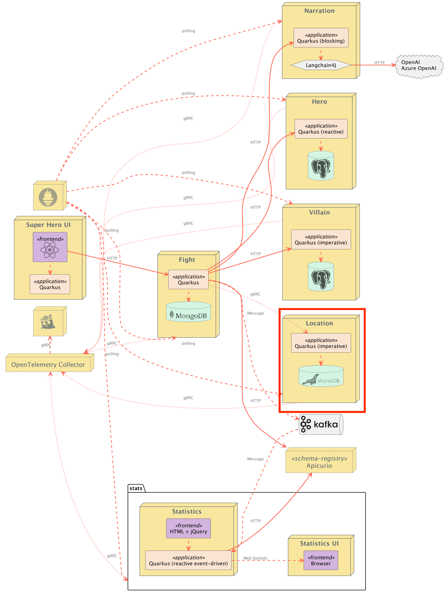

# Superheroes Location Microservice

> **Full documentation: [https://quarkus.io/quarkus-super-heroes/grpc-locations](https://quarkus.io/quarkus-super-heroes/grpc-locations)**

## Introduction

This is the Location gRPC microservice. It is a classical gRPC microservice, written in [Kotlin](https://quarkus.io/guides/kotlin), and exposing CRUD operations on Locations. Location information is stored in a MariaDB database. This service is implemented using [gRPC](https://quarkus.io/guides/grpc-service-implementation) with blocking endpoints and [Quarkus Hibernate ORM with Panache's repository pattern](https://quarkus.io/guides/hibernate-orm-panache-kotlin#using-the-repository-pattern).

Additionally, this application favors constructor injection of beans over field injection (i.e. `@Inject` annotation).

## Running the Application

The application runs on port `8089` (defined by `quarkus.http.port` in [`application.yml`](src/main/resources/application.yml)).

From the `quarkus-super-heroes/grpc-locations` directory, simply run `./mvnw quarkus:dev` to run [Quarkus Dev Mode](https://quarkus.io/guides/maven-tooling#dev-mode). The application will be exposed at http://localhost:8089 and the [Quarkus Dev UI](https://quarkus.io/guides/dev-ui) will be exposed at http://localhost:8089/q/dev.
