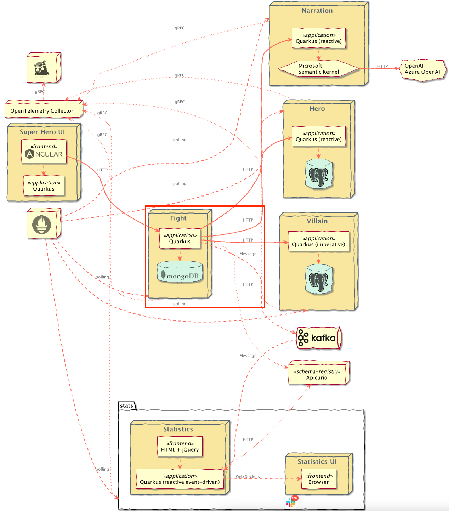

# Superheroes Fight Microservice

## Table of Contents
- [Introduction](#introduction)
    - [Exposed Endpoints](#exposed-endpoints)
- [Configuration](#configuration)
- [Resiliency](#resiliency)
    - [Timeouts](#timeouts)
    - [Fallbacks](#fallbacks)
    - [Retries](#retries)
        - [Hero Client](#hero-client)
        - [Villain Client](#villain-client)
- [Service Discovery and Load Balancing](#service-discovery-and-client-load-balancing)
    - [Service Discovery](#service-discovery)
    - [Client-side Load Balancing](#client-side-load-balancing)
- [Testing](#testing)
    - [Contract testing with Pact](#contract-testing-with-pact) 
- [Running the Application](#running-the-application)
- [Running Locally via Docker Compose](#running-locally-via-docker-compose)
    - [Only Fights Service](#only-fights-service)
    - [Fights Service and all Downstream Dependencies](#fights-service-and-all-downstream-dependencies)
    - [Only Downstream Dependencies](#only-downstream-dependencies)
- [Deploying to Kubernetes](#deploying-to-kubernetes)
    - [Using pre-built images](#using-pre-built-images)
    - [Deploying directly via Kubernetes Extensions](#deploying-directly-via-kubernetes-extensions)

## Introduction
This is the Fight REST API microservice. It is a reactive HTTP microservice exposing an API for performing fights between [Heroes](../rest-heroes) and [Villains](../rest-villains). Each fight is persisted into a MongoDB database and can be retrieved via the REST API. This service is implemented using [RESTEasy Reactive](https://quarkus.io/guides/resteasy-reactive) with reactive endpoints and [Quarkus MongoDB Reactive with Panache's active record pattern](https://quarkus.io/guides/mongodb-panache#reactive).

Fight messages are also published on an Apache Kafka topic called `fights`. The [event-statistics service](../event-statistics) listens for these events. Messages are stored in [Apache Avro](https://avro.apache.org/docs/current) format and [the fight schema](src/main/avro/fight.avsc) is automatically registered in the [Apicurio Schema Registry](https://www.apicur.io/registry). This all uses [built-in extensions from Quarkus](https://quarkus.io/guides/kafka-schema-registry-avro).

### Exposed Endpoints
The following table lists the available REST endpoints. The [OpenAPI document](openapi-schema.yml) for the REST endpoints is also available.

| Path                         | HTTP method | Response Status | Response Object                                                               | Description                                                                                                                             |
|------------------------------|-------------|-----------------|-------------------------------------------------------------------------------|-----------------------------------------------------------------------------------------------------------------------------------------|
| `/api/fights`                | `GET`       | `200`           | [`List<Fight>`](src/main/java/io/quarkus/sample/superheroes/fight/Fight.java) | All Fights. Empty array (`[]`) if none.                                                                                                 |
| `/api/fights`                | `POST`      | `200`           | [`Fight`](src/main/java/io/quarkus/sample/superheroes/fight/Fight.java)       | Performs a fight.                                                                                                                       |
| `/api/fights`                | `POST`      | `400`           |                                                                               | Invalid [`Fighters`](src/main/java/io/quarkus/sample/superheroes/fight/Fighters.java) passed in request body (or no request body found) |
| `/api/fights/randomfighters` | `GET`       | `200`           | [`Fighters`](src/main/java/io/quarkus/sample/superheroes/fight/Fighters.java) | Finds random fighters                                                                                                                   |
| `/api/fights/{id}`           | `GET`       | `200`           | [`Fight`](src/main/java/io/quarkus/sample/superheroes/fight/Fight.java)       | Fight with id == `{id}`                                                                                                                 |
| `/api/fights/{id}`           | `GET`       | `404`           |                                                                               | No Fight with id == `{id}` found                                                                                                        |
| `/api/fights/hello/heroes`   | `GET`       | `200`           | `String`                                                                      | Invokes the "hello" endpoint of the Heroes microservice                                                                                 |
| `/api/fights/hello/villains` | `GET`       | `200`           | `String`                                                                      | Invokes the "hello" endpoint of the Villains microservice                                                                               |

## Configuration
The [`FightConfig`](src/main/java/io/quarkus/sample/superheroes/fight/config/FightConfig.java) stores all the application-specific configuration that can be overridden at runtime.

## Resiliency
### Timeouts
The [`FightService`](src/main/java/io/quarkus/sample/superheroes/fight/service/FightService.java) class uses [timeouts](https://quarkus.io/guides/smallrye-fault-tolerance#adding-resiliency-timeouts) from [SmallRye Fault Tolerance](https://quarkus.io/guides/smallrye-fault-tolerance) to protect against calls to the downstream [Hero](../rest-heroes) and [Villain](../rest-villains) services. Tests for these conditions can be found in [`FightServiceTests`](src/test/java/io/quarkus/sample/superheroes/fight/service/FightServiceTests.java).

### Fallbacks
The [`FightService`](src/main/java/io/quarkus/sample/superheroes/fight/service/FightService.java) class uses [fallbacks](https://quarkus.io/guides/smallrye-fault-tolerance#adding-resiliency-fallbacks) from [SmallRye Fault Tolerance](https://quarkus.io/guides/smallrye-fault-tolerance) to protect against calls to the downstream [Hero](../rest-heroes) and [Villain](../rest-villains) services. Tests for these conditions can be found in [`FightServiceTests`](src/test/java/io/quarkus/sample/superheroes/fight/service/FightServiceTests.java).

### Retries
Retry logic to the downstream [Hero](../rest-heroes) and [Villain](../rest-villains) services is implemented in the clients for each service.

#### Hero Client
The [`HeroRestClient`](src/main/java/io/quarkus/sample/superheroes/fight/client/HeroRestClient.java) is implemented using the [reactive rest client](https://quarkus.io/guides/rest-client-reactive). All of its configuration can be found in [`application.properties`](src/main/resources/application.properties) under the `quarkus.rest-client.hero-client` key. This client is not exposed outside of the `io.quarkus.sample.superheroes.fight.client` package.

Instead, the [`HeroClient`](src/main/java/io/quarkus/sample/superheroes/fight/client/HeroClient.java) class wraps the `HeroRestClient` and adds some resiliency to it:
- The downstream [Hero service](../rest-heroes) returns a `404` if no random [`Hero`](src/main/java/io/quarkus/sample/superheroes/fight/client/Hero.java) is found. `HeroClient` handles this case and simulates the service returning nothing.
- In the event the downstream [Hero service](../rest-heroes) returns an error, `HeroClient` adds 3 retries with a 200ms delay between each retry.

#### Villain Client
The [`VillainClient`](src/main/java/io/quarkus/sample/superheroes/fight/client/VillainClient.java) is implemented using the [JAX-RS client API](https://docs.oracle.com/javaee/7/tutorial/jaxrs-client001.htm) with the [RESTEasy Reactive client](https://quarkus.io/guides/resteasy-reactive#resteasy-reactive-client). All of its configuration can be found in [`application.properties`](src/main/resources/application.properties) under the `fight.villain.client-base-url` key.
- The downstream [Villain service](../rest-villains) returns a `404` if no random [`Villain`](src/main/java/io/quarkus/sample/superheroes/fight/client/Villain.java) is found. `VillainClient` handles this case and simulates the service returning nothing.
- In the event the downstream [Villain service](../rest-heroes) returns an error, `VillainClient` adds 3 retries with a 200ms delay between each retry.

## Service Discovery and Client Load Balancing
The fight service implements service discovery and client-side load balancing when making downstream calls to the [`rest-heroes`](../rest-heroes) and [`rest-villains`](../rest-villains) services. The service discovery is implemented in Quarkus using [SmallRye Stork](https://quarkus.io/blog/smallrye-stork-intro).

Stork [integrates directly with the Quarkus REST Client Reactive](http://smallrye.io/smallrye-stork/1.1.0/quarkus). This means that there is no additional code needed in order to take advantage of Stork's service discovery and client-side load balancing.

> You could disable Stork completely for the `HeroRestClient` by setting `quarkus.rest-client.hero-client.url` to any non-Stork URL (i.e. something that doesn't start with `stork://`). Similarly, you could disable Stork completely for the `VillainClient` by setting `fight.villain.client-base-url` to any non-Stork URL.

### Service Discovery
In local development mode, as well as when running via Docker Compose, SmallRye Stork is configured using [static list discovery](https://github.com/smallrye/smallrye-stork/blob/main/docs/service-discovery/static-list.md). In this mode, the downstream URLs are statically defined in an address list. In [`application.properties`](src/main/resources/application.properties), see the `quarkus.stork.hero-service.service-discovery.address-list` and `quarkus.stork.villain-service.service-discovery.address-list` properties.

When [running in Kubernetes](https://quarkus.io/blog/stork-kubernetes-discovery), Stork is configured to use the [Kubernetes Service Discovery](http://smallrye.io/smallrye-stork/1.1.0/kubernetes). In this mode, Stork will read the Kubernetes `Service`s for the [`rest-heroes`](../rest-heroes) and [`rest-villains`](../rest-villains) services to obtain the instance information. Additionally, the instance information has been configured to refresh every minute. See the `rest-fights-config` ConfigMap in [the Kubernetes deployment descriptors](deploy/k8s). Look for the `quarkus.stork.*` properties within the various `ConfigMap`s.

All of the other Stork service discovery mechanisms ([Consul](http://smallrye.io/smallrye-stork/1.1.0/consul) and [Eureka](http://smallrye.io/smallrye-stork/1.1.0/eureka)) can be used simply by updating the configuration appropriately according to the Stork documentation.

### Client-Side Load Balancing
In all cases, the default load balancing algorithm used is [round robin](http://smallrye.io/smallrye-stork/1.1.0/round-robin). All of the other load balancing algorithms ([random](http://smallrye.io/smallrye-stork/1.1.0/random), [least requests](http://smallrye.io/smallrye-stork/1.1.0/least-requests), [least response time](http://smallrye.io/smallrye-stork/1.1.0/response-time), and [power of two choices](http://smallrye.io/smallrye-stork/1.1.0/power-of-two-choices)) are available on the application's classpath, so feel free to play around with them by updating the configuration appropriately according to the Stork documentation.

## Testing
This application has a full suite of tests, including an [integration test suite](src/test/java/io/quarkus/sample/superheroes/fight/rest/FightResourceIT.java). 
- The test suite uses [Wiremock](http://wiremock.org/) for [mocking http calls](https://quarkus.io/guides/rest-client-reactive#using-a-mock-http-server-for-tests) (see [`HeroesVillainsWiremockServerResource`](src/test/java/io/quarkus/sample/superheroes/fight/HeroesVillainsWiremockServerResource.java)) to the downstream [Hero](../rest-heroes) and [Villain](../rest-villains) services.
- The test suite configures the application to use the [in-memory connector](https://smallrye.io/smallrye-reactive-messaging/smallrye-reactive-messaging/3.11/testing/testing.html) from [SmallRye Reactive Messaging](https://smallrye.io/smallrye-reactive-messaging) (see the `%test.mp.messaging.outgoing.fights` configuration in [`application.properties`](src/main/resources/application.properties)) for verifying interactions with Kafka.
- The [integration test suite](src/test/java/io/quarkus/sample/superheroes/fight/rest/FightResourceIT.java) uses [Quarkus Dev Services](https://quarkus.io/guides/getting-started-testing#testing-dev-services) (see [`KafkaConsumerResource`](src/test/java/io/quarkus/sample/superheroes/fight/KafkaConsumerResource.java)) to interact with a Kafka instance so messages placed onto the Kafka broker by the application can be verified.

### Contract testing with Pact
[Pact](https://pact.io) is a code-first tool for testing HTTP and message integrations using `contract tests`. Contract tests assert that inter-application messages conform to a shared understanding that is documented in a contract. Without contract testing, the only way to ensure that applications will work correctly together is by using expensive and brittle integration tests.

[Eric Deandrea](https://developers.redhat.com/author/eric-deandrea) and [Holly Cummins](https://hollycummins.com) recently spoke about contract testing with Pact and used the Quarkus Superheroes for their demos. [Watch the replay](https://www.youtube.com/watch?v=vYwkDPrzqV8) and [view the slides](https://hollycummins.com/modern-microservices-testing-pitfalls-devoxx/) if you'd like to learn more about contract testing.

The `rest-fights` application is both a [Pact _Consumer_](https://docs.pact.io/consumer) and a [Pact _Provider_](https://docs.pact.io/provider). As a _Consumer_, it should be responsible for defining the contracts between itself and its providers ([`rest-heroes`](../rest-heroes) & [`rest-villains`](../rest-villains)). As a _Provider_, is should run provider verification tests against contracts produced by consumers.

As [this README states](src/test/resources/pacts/README.md), contracts generally should be hosted in a [Pact Broker](https://docs.pact.io/pact_broker) and then automatically discovered in the provider verification tests.

One of the main goals of the Superheroes application is to be super simple and just "work" by anyone who may clone this repo. That being said, we can't make any assumptions about where a Pact broker may be or any of the credentials required to access it.

This consumer generates the following contracts:
- [`HeroConsumerContractTests.java`](src/test/java/io/quarkus/sample/superheroes/fight/client/HeroConsumerContractTests.java) generates the [`rest-fights-rest-heroes.json`](../rest-heroes/src/test/resources/pacts/rest-fights-rest-heroes.json) contract.
- [`VillainConsumerContractTests.java`](src/test/java/io/quarkus/sample/superheroes/fight/client/VillainConsumerContractTests.java) generates the [`rest-fights-rest-villains.json`](../rest-villains/src/test/resources/pacts/rest-fights-rest-villains.json) contract.

The contracts are committed into the provider's version control simply for easy of use and reproducibility.

Additionally, the [Pact contract](src/test/resources/pacts/ui-super-heroes-rest-fights.json) is committed into this application's source tree inside the [`src/test/resources/pacts` directory](src/test/resources/pacts).

The Pact consumer contract tests don't currently work with Quarkus dev mode and continuous testing for this project, because of the [test profiles](https://github.com/quarkiverse/quarkus-pact/issues/58).
The consumer contract tests ([`HeroConsumerContractTests.java`](src/test/java/io/quarkus/sample/superheroes/fight/client/HeroConsumerContractTests.java) & [`VillainConsumerContractTests.java`](src/test/java/io/quarkus/sample/superheroes/fight/client/VillainConsumerContractTests.java)) are only executed in 'normal' testing, not continuous testing.

Provider tests do work, with the workaround that the scope of the extension to be more generous than the natural `test` scope.

The consumer contract tests and provider verification tests **ARE** executed during this project's CI/CD processes. They run against any pull requests and any commits back to the `main` branch.

The Pact tests use the [Quarkus Pact extension](https://github.com/quarkiverse/quarkus-pact). This extension is recommended to give the best user experience and ensure compatibility

## Running the Application
First you need to start up all of the downstream services ([Heroes Service](../rest-heroes) and [Villains Service](../rest-villains) - the [Event Statistics Service](../event-statistics) is optional).

The application runs on port `8082` (defined by `quarkus.http.port` in [`application.properties`](src/main/resources/application.properties)).

From the `quarkus-super-heroes/rest-fights` directory, simply run `./mvnw quarkus:dev` to run [Quarkus Dev Mode](https://quarkus.io/guides/maven-tooling#dev-mode), or running `quarkus dev` using the [Quarkus CLI](https://quarkus.io/guides/cli-tooling). The application will be exposed at `http://localhost:8082` and the [Quarkus Dev UI](https://quarkus.io/guides/dev-ui) will be exposed at `http://localhost:8082/q/dev`. [Quarkus Dev Services](https://quarkus.io/guides/dev-services) will ensure the MongoDB instance, an Apache Kafka instance, and an Apicurio Schema Registry are all started and configured.

**NOTE:** Running the application outside of Quarkus Dev Mode requires standing up a MongoDB instance, an Apache Kafka instance, and an Apicurio Schema Registry and binding them to the app.

Furthermore, since this service also communicates with additional downstream services ([rest-heroes](../rest-heroes) and [rest-villains](../rest-villains)), those would need to be stood up as well, although this service does have fallbacks in case those other services aren't available.

By default, the application is configured with the following:

| Description              | Environment Variable                                          | Java Property                                                 | Value                                    |
|--------------------------|---------------------------------------------------------------|---------------------------------------------------------------|------------------------------------------|
| Database Host            | `QUARKUS_MONGODB_HOSTS`                                       | `quarkus.mongodb.hosts`                                       | `localhost:27017`                        |
| Database username        | `QUARKUS_MONGODB_CREDENTIALS_USERNAME`                        | `quarkus.mongodb.credentials.username`                        | `superfight`                             |
| Database password        | `QUARKUS_MONGODB_CREDENTIALS_PASSWORD`                        | `quarkus.mongodb.credentials.password`                        | `superfight`                             |
| Kafka Bootstrap servers  | `KAFKA_BOOTSTRAP_SERVERS`                                     | `kafka.bootstrap.servers`                                     | `PLAINTEXT://localhost:9092`             |
| Apicurio Schema Registry | `MP_MESSAGING_CONNECTOR_SMALLRYE_KAFKA_APICURIO_REGISTRY_URL` | `mp.messaging.connector.smallrye-kafka.apicurio.registry.url` | `http://localhost:8086/apis/registry/v2` |
| Heroes Service URL       | `QUARKUS_REST_CLIENT_HERO_CLIENT_URL`                         | `quarkus.rest-client.hero-client.url`                         | `stork://hero-service`                   |
| Villains Service URL     | `FIGHT_VILLAIN_CLIENT_BASE_URL`                               | `fight.villain.client-base-url`                               | `stork://villain-service`                |

## Running Locally via Docker Compose
Pre-built images for this application can be found at [`quay.io/quarkus-super-heroes/rest-fights`](https://quay.io/repository/quarkus-super-heroes/rest-fights?tab=tags). 

### Only Fights Service
Pick one of the 4 versions of the application from the table below and execute the appropriate docker compose command from the `quarkus-super-heroes/rest-fights` directory.

   > **NOTE**: You may see errors as the applications start up. This may happen if an application completes startup before one if its required services (i.e. database, kafka, etc). This is fine. Once everything completes startup things will work fine.

| Description | Image Tag       | Docker Compose Run Command                                               |
|-------------|-----------------|--------------------------------------------------------------------------|
| JVM Java 11 | `java11-latest` | `docker compose -f deploy/docker-compose/java11.yml up --remove-orphans` |
| JVM Java 17 | `java17-latest` | `docker compose -f deploy/docker-compose/java17.yml up --remove-orphans` |
| Native      | `native-latest` | `docker compose -f deploy/docker-compose/native.yml up --remove-orphans` |

### Fights Service and all Downstream Dependencies
The above Docker Compose files are meant for standing up this application and the required database, Kafka broker, and Apicurio Schema Registry only. If you want to stand up this application and its downstream services ([rest-villains](../rest-villains) and [rest-heroes](../rest-heroes)), pick one of the 4 versions from the table below and execute the appropriate docker compose command from the `quarkus-super-heroes/rest-fights` directory.

   > **NOTE**: You may see errors as the applications start up. This may happen if an application completes startup before one if its required services (i.e. database, kafka, etc). This is fine. Once everything completes startup things will work fine.

| Description | Image Tag       | Docker Compose Run Command                                                              |
|-------------|-----------------|-----------------------------------------------------------------------------------------|
| JVM Java 11 | `java11-latest` | `docker compose -f deploy/docker-compose/java11-all-downstream.yml up --remove-orphans` |
| JVM Java 17 | `java17-latest` | `docker compose -f deploy/docker-compose/java17-all-downstream.yml up --remove-orphans` |
| Native      | `native-latest` | `docker compose -f deploy/docker-compose/native-all-downstream.yml up --remove-orphans` |

### Only Downstream Dependencies
If you want to develop the Fights service (i.e. via [Quarkus Dev Mode](https://quarkus.io/guides/maven-tooling#dev-mode)) but want to stand up just it's downstream services ([rest-villains](../rest-villains) and [rest-heroes](../rest-heroes)), pick one of the 4 versions from the table below and execute the appropriate docker compose command from the `quarkus-super-heroes` directory.

> **NOTE**: You may see errors as the applications start up. This may happen if an application completes startup before one if its required services (i.e. database, kafka, etc). This is fine. Once everything completes startup things will work fine.

| Description | Image Tag       | Docker Compose Run Command                                                                                                             |
|-------------|-----------------|----------------------------------------------------------------------------------------------------------------------------------------|
| JVM Java 11 | `java11-latest` | `docker compose -f rest-heroes/deploy/docker-compose/java11.yml -f rest-villains/deploy/docker-compose/java11.yml up --remove-orphans` |
| JVM Java 17 | `java17-latest` | `docker compose -f rest-heroes/deploy/docker-compose/java17.yml -f rest-villains/deploy/docker-compose/java17.yml up --remove-orphans` |
| Native      | `native-latest` | `docker compose -f rest-heroes/deploy/docker-compose/native.yml -f rest-villains/deploy/docker-compose/native.yml up --remove-orphans` |

If you want to stand up the entire system, [follow these instructions](../README.md#running-locally-via-docker-compose).

Once started the application will be exposed at `http://localhost:8082`. The Apicurio Schema Registry will be exposed at `http://localhost:8086`.

## Deploying to Kubernetes
The application can be [deployed to Kubernetes using pre-built images](#using-pre-built-images) or by [deploying directly via the Quarkus Kubernetes Extension](#deploying-directly-via-kubernetes-extensions). Each of these is discussed below.

### Using pre-built images
Pre-built images for this application can be found at [`quay.io/quarkus-super-heroes/rest-fights`](https://quay.io/repository/quarkus-super-heroes/rest-fights?tab=tags).

Deployment descriptors for these images are provided in the [`deploy/k8s`](deploy/k8s) directory. There are versions for [OpenShift](https://www.openshift.com), [Minikube](https://quarkus.io/guides/deploying-to-kubernetes#deploying-to-minikube), [Kubernetes](https://www.kubernetes.io), and [KNative](https://knative.dev).

Pick one of the 4 versions of the application from the table below and deploy the appropriate descriptor from the [`deploy/k8s` directory](deploy/k8s).

| Description | Image Tag       | OpenShift Descriptor                                      | Minikube Descriptor                                     | Kubernetes Descriptor                                       | KNative Descriptor                                    |
|-------------|-----------------|-----------------------------------------------------------|---------------------------------------------------------|-------------------------------------------------------------|-------------------------------------------------------|
| JVM Java 11 | `java11-latest` | [`java11-openshift.yml`](deploy/k8s/java11-openshift.yml) | [`java11-minikube.yml`](deploy/k8s/java11-minikube.yml) | [`java11-kubernetes.yml`](deploy/k8s/java11-kubernetes.yml) | [`java11-knative.yml`](deploy/k8s/java11-knative.yml) |
| JVM Java 17 | `java17-latest` | [`java17-openshift.yml`](deploy/k8s/java17-openshift.yml) | [`java17-minikube.yml`](deploy/k8s/java17-minikube.yml) | [`java17-kubernetes.yml`](deploy/k8s/java17-kubernetes.yml) | [`java17-knative.yml`](deploy/k8s/java17-knative.yml) |
| Native      | `native-latest` | [`native-openshift.yml`](deploy/k8s/native-openshift.yml) | [`native-minikube.yml`](deploy/k8s/native-minikube.yml) | [`native-kubernetes.yml`](deploy/k8s/native-kubernetes.yml) | [`native-knative.yml`](deploy/k8s/native-knative.yml) |

The application is exposed outside of the cluster on port `80`.

These are only the descriptors for this application and the required database, Kafka broker, and Apicurio Schema Registry only. If you want to deploy this application and its downstream services ([rest-villains](../rest-villains) and [rest-heroes](../rest-heroes)), pick one of the 4 versions of the application from the table below and deploy the appropriate descriptor from the [`rest-fights/deploy/k8s` directory](deploy/k8s).

| Description | Image Tag       | OpenShift Descriptor                                                                    | Minikube Descriptor                                                                   | Kubernetes Descriptor                                                                     | KNative Descriptor                                                                  |
|-------------|-----------------|-----------------------------------------------------------------------------------------|---------------------------------------------------------------------------------------|-------------------------------------------------------------------------------------------|-------------------------------------------------------------------------------------|
| JVM Java 11 | `java11-latest` | [`java11-openshift-all-downstream.yml`](deploy/k8s/java11-openshift-all-downstream.yml) | [`java11-minikube-all-downstream.yml`](deploy/k8s/java11-minikube-all-downstream.yml) | [`java11-kubernetes-all-downstream.yml`](deploy/k8s/java11-kubernetes-all-downstream.yml) | [`java11-knative-all-downstream.yml`](deploy/k8s/java11-knative-all-downstream.yml) |
| JVM Java 17 | `java17-latest` | [`java17-openshift-all-downstream.yml`](deploy/k8s/java17-openshift-all-downstream.yml) | [`java17-minikube-all-downstream.yml`](deploy/k8s/java17-minikube-all-downstream.yml) | [`java17-kubernetes-all-downstream.yml`](deploy/k8s/java17-kubernetes-all-downstream.yml) | [`java17-knative-all-downstream.yml`](deploy/k8s/java17-knative-all-downstream.yml) |
| Native      | `native-latest` | [`native-openshift-all-downstream.yml`](deploy/k8s/native-openshift-all-downstream.yml) | [`native-minikube-all-downstream.yml`](deploy/k8s/native-minikube-all-downstream.yml) | [`native-kubernetes-all-downstream.yml`](deploy/k8s/native-kubernetes-all-downstream.yml) | [`native-knative-all-downstream.yml`](deploy/k8s/native-knative-all-downstream.yml) |

Each application is exposed outside of the cluster on port `80`.

If you want to deploy the entire system, [follow these instructions](../README.md#deploying-to-kubernetes).

### Deploying directly via Kubernetes Extensions
Following the [deployment section](https://quarkus.io/guides/deploying-to-kubernetes#deployment) of the [Quarkus Kubernetes Extension Guide](https://quarkus.io/guides/deploying-to-kubernetes) (or the [deployment section](https://quarkus.io/guides/deploying-to-openshift#build-and-deployment) of the [Quarkus OpenShift Extension Guide](https://quarkus.io/guides/deploying-to-openshift) if deploying to [OpenShift](https://openshift.com)), you can run one of the following commands to deploy the application and any of its dependencies (see [Kubernetes (and variants) resource generation](../docs/automation.md#kubernetes-and-variants-resource-generation) of the [automation strategy document](../docs/automation.md)) to your preferred Kubernetes distribution.

> **NOTE:** For non-OpenShift or minikube Kubernetes variants, you will most likely need to [push the image to a container registry](https://quarkus.io/guides/container-image#pushing) by adding the `-Dquarkus.container-image.push=true` flag, as well as setting the `quarkus.container-image.registry`, `quarkus.container-image.group`, and/or the `quarkus.container-image.name` properties to different values.

| Target Platform        | Java Version | Command                                                                                                                                                                                                                                         |
|------------------------|:------------:|-------------------------------------------------------------------------------------------------------------------------------------------------------------------------------------------------------------------------------------------------|
| Kubernetes             |      11      | `./mvnw clean package -Dquarkus.profile=kubernetes -Dquarkus.kubernetes.deploy=true -DskipTests`                                                                                                                                                |
| Kubernetes             |      17      | `./mvnw clean package -Dquarkus.profile=kubernetes-17 -Dquarkus.kubernetes.deploy=true -DskipTests`                                                                                                                                             |
| OpenShift              |      11      | `./mvnw clean package -Dquarkus.profile=openshift -Dquarkus.container-image.registry=image-registry.openshift-image-registry.svc:5000 -Dquarkus.container-image.group=$(oc project -q) -Dquarkus.kubernetes.deploy=true -DskipTests`            |
| OpenShift              |      17      | `./mvnw clean package -Dquarkus.profile=openshift-17 -Dquarkus.container-image.registry=image-registry.openshift-image-registry.svc:5000 -Dquarkus.container-image.group=$(oc project -q) -Dquarkus.kubernetes.deploy=true -DskipTests`         |
| Minikube               |      11      | `./mvnw clean package -Dquarkus.profile=minikube -Dquarkus.kubernetes.deploy=true -DskipTests`                                                                                                                                                  |
| Minikube               |      17      | `./mvnw clean package -Dquarkus.profile=minikube-17 -Dquarkus.kubernetes.deploy=true -DskipTests`                                                                                                                                               |
| KNative                |      11      | `./mvnw clean package -Dquarkus.profile=knative -Dquarkus.kubernetes.deploy=true -DskipTests`                                                                                                                                                   |
| KNative                |      17      | `./mvnw clean package -Dquarkus.profile=knative-17 -Dquarkus.kubernetes.deploy=true -DskipTests`                                                                                                                                                |
| KNative (on OpenShift) |      11      | `./mvnw clean package -Dquarkus.profile=knative-openshift -Dquarkus.container-image.registry=image-registry.openshift-image-registry.svc:5000 -Dquarkus.container-image.group=$(oc project -q) -Dquarkus.kubernetes.deploy=true -DskipTests`    |
| KNative (on OpenShift) |      17      | `./mvnw clean package -Dquarkus.profile=knative-openshift-17 -Dquarkus.container-image.registry=image-registry.openshift-image-registry.svc:5000 -Dquarkus.container-image.group=$(oc project -q) -Dquarkus.kubernetes.deploy=true -DskipTests` |

You may need to adjust other configuration options as well (see [Quarkus Kubernetes Extension configuration options](https://quarkus.io/guides/deploying-to-kubernetes#configuration-options) and [Quarkus OpenShift Extension configuration options](https://quarkus.io/guides/deploying-to-openshift#configuration-reference)).

> The [`do_build` function in the `generate-k8s-resources.sh` script](../scripts/generate-k8s-resources.sh) uses these extensions to generate the manifests in the [`deploy/k8s` directory](deploy/k8s).
