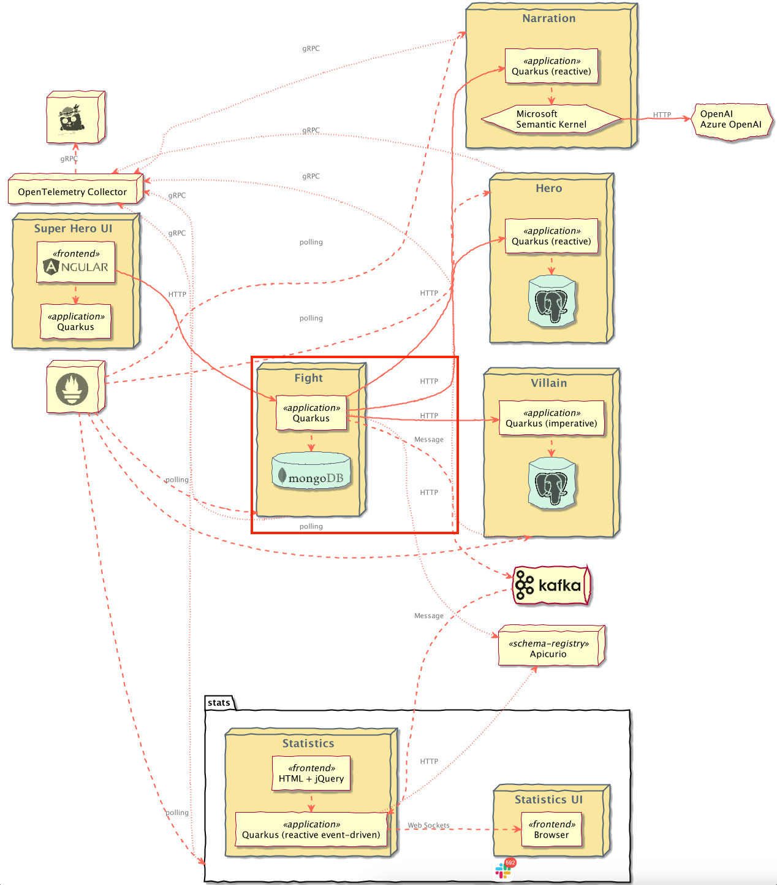

# Superheroes Fight Microservice

> **Full documentation: [https://quarkus.io/quarkus-super-heroes/rest-fights](https://quarkus.io/quarkus-super-heroes/rest-fights)**

## Introduction

This is the Fight REST API microservice. It is a reactive HTTP microservice exposing an API for performing fights between [Heroes](../rest-heroes) and [Villains](../rest-villains), in a location obtained from the [Location Service](../grpc-locations). Once a winner has been determined, the [Narration service](../rest-narration) creates a narration of the fight.

Each fight and its corresponding narration is then persisted into a MongoDB database and can be retrieved via the REST API. This service is implemented using [RESTEasy Reactive](https://quarkus.io/guides/resteasy-reactive) with reactive endpoints and [Quarkus MongoDB Reactive with Panache's active record pattern](https://quarkus.io/guides/mongodb-panache#reactive).

This service uses a **contract-first** approach: the REST API interface is generated at build time from the OpenAPI specification ([`src/main/resources/openapi/openapi.yml`](src/main/resources/openapi/openapi.yml)) using the [Quarkiverse OpenAPI Generator Server extension](https://docs.quarkiverse.io/quarkus-openapi-generator/dev/server.html).

Fight messages are also published on an Apache Kafka topic called `fights`. The [event-statistics service](../event-statistics) listens for these events. Messages are stored in [Apache Avro](https://avro.apache.org/docs/current) format and the fight schema is automatically registered in the [Apicurio Schema Registry](https://www.apicur.io/registry).

## Running the Application

The application runs on port `8082` (defined by `quarkus.http.port` in [`application.properties`](src/main/resources/application.properties)).

From the `quarkus-super-heroes/rest-fights` directory, simply run `./mvnw quarkus:dev` to run [Quarkus Dev Mode](https://quarkus.io/guides/maven-tooling#dev-mode). The application will be exposed at `http://localhost:8082` and the [Quarkus Dev UI](https://quarkus.io/guides/dev-ui) will be exposed at `http://localhost:8082/q/dev`. [Quarkus Dev Services](https://quarkus.io/guides/dev-services) will ensure the MongoDB instance, an Apache Kafka instance, and an Apicurio Schema Registry are all started and configured.
