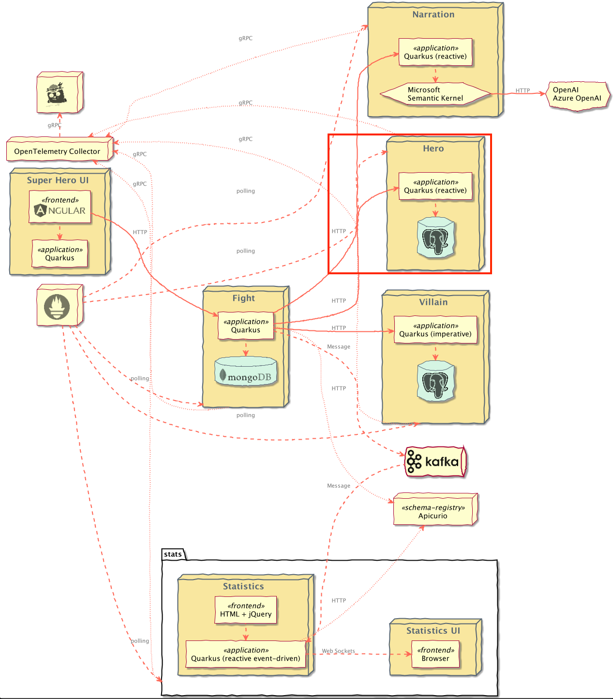
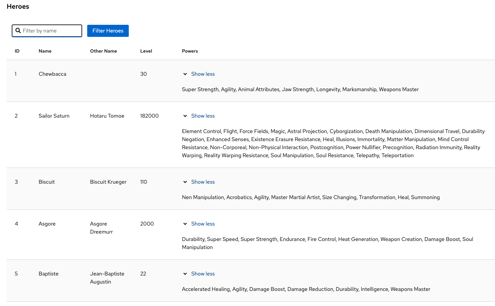

# Superheroes Hero Microservice

> **Full documentation: [https://quarkus.io/quarkus-super-heroes/rest-heroes](https://quarkus.io/quarkus-super-heroes/rest-heroes)**

## Introduction

This is the Hero REST API microservice. It is a reactive HTTP microservice exposing CRUD operations on Heroes. Hero information is stored in a PostgreSQL database. This service is implemented using [RESTEasy Reactive](https://quarkus.io/guides/resteasy-reactive) with reactive endpoints and [Quarkus Hibernate Reactive with Panache's repository pattern](https://quarkus.io/guides/hibernate-reactive-panache#solution-2-using-the-repository-pattern).

This service uses a **contract-first** approach: the REST API interface is generated at build time from the OpenAPI specification ([`src/main/resources/openapi/openapi.yml`](src/main/resources/openapi/openapi.yml)) using the [Quarkiverse OpenAPI Generator Server extension](https://docs.quarkiverse.io/quarkus-openapi-generator/dev/server.html).

Additionally, this application favors constructor injection of beans over field injection (i.e. `@Inject` annotation).

## Running the Application

The application runs on port `8083` (defined by `quarkus.http.port` in [`application.yml`](src/main/resources/application.yml)).

From the `quarkus-super-heroes/rest-heroes` directory, simply run `./mvnw quarkus:dev` to run [Quarkus Dev Mode](https://quarkus.io/guides/maven-tooling#dev-mode). The application will be exposed at http://localhost:8083 and the [Quarkus Dev UI](https://quarkus.io/guides/dev-ui) will be exposed at http://localhost:8083/q/dev.

