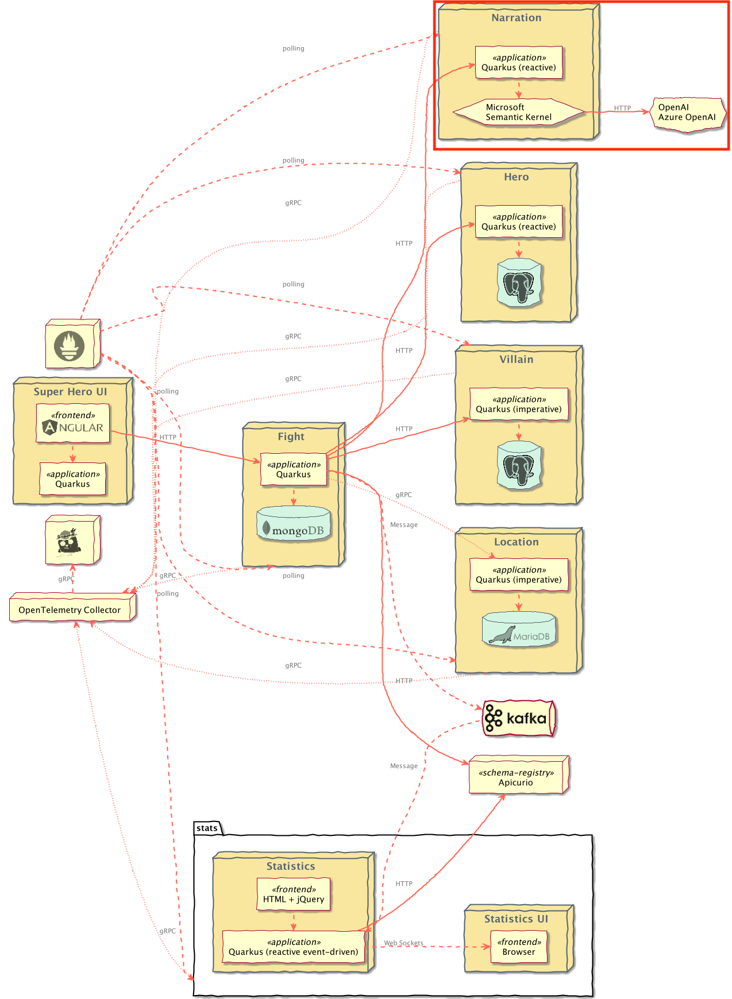

# Superheroes Narration Microservice

## Table of Contents
- [Introduction](#introduction)
    - [Exposed Endpoints](#exposed-endpoints)
- [Contract testing with Pact](#contract-testing-with-pact)
- [Running the Application](#running-the-application)
    - [Integration with OpenAI Providers](#integration-with-openai-providers)
        - [Making live calls to OpenAI Providers](#making-live-calls-to-openai-providers) 
- [Running Locally via Docker Compose](#running-locally-via-docker-compose)
- [Deploying to Kubernetes](#deploying-to-kubernetes)
    - [Using pre-built images](#using-pre-built-images)
    - [Deploying directly via Kubernetes Extensions](#deploying-directly-via-kubernetes-extensions)

[](https://sonarcloud.io/summary/new_code?id=quarkusio-quarkus-super-heroes_rest-narration) [](https://sonarcloud.io/summary/new_code?id=quarkusio-quarkus-super-heroes_rest-narration) [](https://sonarcloud.io/summary/new_code?id=quarkusio-quarkus-super-heroes_rest-narration) [](https://sonarcloud.io/summary/new_code?id=quarkusio-quarkus-super-heroes_rest-narration) [](https://sonarcloud.io/summary/new_code?id=quarkusio-quarkus-super-heroes_rest-narration) [](https://sonarcloud.io/summary/new_code?id=quarkusio-quarkus-super-heroes_rest-narration)

## Introduction
This is the Narration REST API microservice. It is a blocking HTTP microservice using the [Quarkus LangChain4J extension](https://docs.quarkiverse.io/quarkus-langchain4j/dev/index.html) to integrate with an AI service to generate text narrating a given fight.

The Narration microservice needs to access an AI service to generate the text narrating the fight. The default codebase uses [OpenAI](https://openai.com/) (via the [`quarkus-langchain4j-openai` extension](https://docs.quarkiverse.io/quarkus-langchain4j/dev/openai.html)). This extension could be swapped for the [`quarkus-langchain4j-azure-openai` extension](https://docs.quarkiverse.io/quarkus-langchain4j/dev/openai.html#_azure_openai) with little to no code changes to connect to [Azure OpenAI](https://azure.microsoft.com/en-us/products/ai-services/openai-service).

Additionally, the service can generate images and image captions from a narration using [DALL-E](https://openai.com/research/dall-e).

> [!NOTE]
> Azure OpenAI, or "OpenAI on Azure" is a service that provides REST API access to OpenAI’s models, including the GPT-4, GPT-3, Codex and Embeddings series. The difference between OpenAI and Azure OpenAI is that it runs on Azure global infrastructure, which meets your production needs for critical enterprise security, compliance, and regional availability.

This service is implemented using [RESTEasy Reactive](https://quarkus.io/guides/resteasy-reactive) with blocking endpoints. Additionally, this application favors constructor injection of beans over field injection (i.e. `@Inject` annotation).



### Exposed Endpoints
The following table lists the available REST endpoints. The [OpenAPI document](openapi-schema.yml) for the REST endpoints is also available.

| Path                   | HTTP method | Response Status | Response Object                                                                       | Description                                                                                                                     |
|------------------------|-------------|-----------------|---------------------------------------------------------------------------------------|---------------------------------------------------------------------------------------------------------------------------------|
| `/api/narration`       | `POST`      | `200`           | `String`                                                                              | Creates a narration for the passed in [`Fight`](src/main/java/io/quarkus/sample/superheroes/narration/Fight.java) request body. |
| `/api/narration`       | `POST`      | `400`           |                                                                                       | Invalid [`Fight`](src/main/java/io/quarkus/sample/superheroes/narration/Fight.java)                                             |
| `/api/narration/image` | `POST`      | `200`           | [`FightImage`](src/main/java/io/quarkus/sample/superheroes/narration/FightImage.java) | Generate an image and caption using DALL-E for a narration                                                                      |
| `/api/narration/image` | `POST`      | `400`           |                                                                                       | Invalid narration passed in                                                                                                     |
| `/api/narration/hello` | `GET`       | `200`           | `String`                                                                              | Ping "hello" endpoint                                                                                                           |

## Contract testing with Pact
[Pact](https://pact.io) is a code-first tool for testing HTTP and message integrations using `contract tests`. Contract tests assert that inter-application messages conform to a shared understanding that is documented in a contract. Without contract testing, the only way to ensure that applications will work correctly together is by using expensive and brittle integration tests.

[Eric Deandrea](https://developers.redhat.com/author/eric-deandrea) and [Holly Cummins](https://hollycummins.com) recently spoke about contract testing with Pact and used the Quarkus Superheroes for their demos. [Watch the replay](https://www.youtube.com/watch?v=vYwkDPrzqV8) and [view the slides](https://hollycummins.com/modern-microservices-testing-pitfalls-devoxx/) if you'd like to learn more about contract testing.

The `rest-narration` application is a [Pact _Provider_](https://docs.pact.io/provider), and as such, should run provider verification tests against contracts produced by consumers.

As [this README states](src/test/resources/pacts/README.md), contracts generally should be hosted in a [Pact Broker](https://docs.pact.io/pact_broker) and then automatically discovered in the provider verification tests.

One of the main goals of the Superheroes application is to be super simple and just "work" by anyone who may clone this repo. That being said, we can't make any assumptions about where a Pact broker may be or any of the credentials required to access it.

Therefore, the [Pact contract](src/test/resources/pacts/rest-fights-rest-narration.json) is committed into this application's source tree inside the [`src/test/resources/pacts` directory](src/test/resources/pacts). In a realistic
scenario, if a broker wasn't used, the consumer's CI/CD would commit the contracts into this repository's source control.

The Pact tests use the [Quarkus Pact extension](https://github.com/quarkiverse/quarkus-pact). This extension is recommended to give the best user experience and ensure compatibility.

## Running the Application
The application runs on port `8087` (defined by `quarkus.http.port` in [`application.properties`](src/main/resources/application.properties)).

From the `quarkus-super-heroes/rest-narration` directory, simply run `./mvnw quarkus:dev` to run [Quarkus Dev Mode](https://quarkus.io/guides/maven-tooling#dev-mode), or running `quarkus dev` using the [Quarkus CLI](https://quarkus.io/guides/cli-tooling). The application will be exposed at http://localhost:8087 and the [Quarkus Dev UI](https://quarkus.io/guides/dev-ui) will be exposed at http://localhost:8087/q/dev.

### Integration with OpenAI Providers
Currently, the only supported OpenAI providers are the [Microsoft Azure OpenAI Service](https://azure.microsoft.com/en-us/products/ai-services/openai-service) and [OpenAI](https://openai.com/). The application uses [OpenAI](https://openai.com/) via the [`quarkus-langchain4j-openai` extension](https://docs.quarkiverse.io/quarkus-langchain4j/dev/openai.html) as its default. This integration requires creating resources, either on OpenAI or Azure, in order to work properly.

For Azure, the [`create-azure-openai-resources.sh` script](../scripts/create-azure-openai-resources.sh) can be used to create the required Azure resources. It will provide you all the [necessary configuration](#azure-openai-properties). Similarly, the [`delete-azure-openai-resources.sh` script](../scripts/delete-azure-openai-resources.sh) can be used to delete the Azure resources.

> [!CAUTION]
> Using Azure OpenAI or OpenAI may not be a free resource for you, so please understand this! Unless configured otherwise, this application does **NOT** communicate with any external service. Instead, by default, it just returns a default narration.
> 

#### Making live calls to OpenAI Providers
Because of this integration and our goal to keep this application working at all times, all the OpenAI integration is disabled by default. A default narration will be provided. In dev mode, the [Quarkus WireMock extension](https://docs.quarkiverse.io/quarkus-wiremock/dev/index.html) serves a default response.

If you'd like to make live calls to an OpenAI provider, set the `-Dquarkus.profile=openai` or `-Dquarkus.profile=azure-openai` property. This will turn off the [Quarkus WireMock](https://docs.quarkiverse.io/quarkus-wiremock/dev/index.html) functionality and set the application back up to talk to the OpenAI provider. You still need to specify your provider-specific properties, though.

Here's a quick look at what the UI would look like with this integration turned on:

https://github.com/quarkusio/quarkus-super-heroes/assets/363447/55a0a63f-c636-4719-9a7b-9a9034116e77

##### OpenAI 

**Dev Mode:**
```bash
quarkus dev --clean -Dquarkus.profile=openai -Dquarkus.langchain4j.openai.api-key=my-key
```

**Running via `java -jar`**:
```bash
./mvnw clean package -DskipTests

java -Dquarkus.profile=openai -Dquarkus.langchain4j.openai.api-key=my-key -jar target/quarkus-app/quarkus-run.jar
```

##### Azure OpenAI

**Dev Mode:**
```bash
quarkus dev --clean -Dquarkus.profile=azure-openai -Dquarkus.langchain4j.azure-openai.api-key=my-key -Dquarkus.langchain4j.azure-openai.resource-name=my-resource-name -Dquarkus.langchain4j.azure-openai.deployment-name=my-deployment-name
```

**Running via `java -jar`**:
```bash
./mvnw clean package -DskipTests -Dquarkus.profile=azure-openai

java -Dquarkus.profile=azure-openai -Dquarkus.langchain4j.azure-openai.api-key=my-key -Dquarkus.langchain4j.azure-openai.resource-name=my-resource-name -Dquarkus.langchain4j.azure-openai.deployment-name=my-deployment-name -jar target/quarkus-app/quarkus-run.jar
```
 
> [!NOTE]
> The application still has resiliency built-in in case of failures.

To enable the OpenAI integration the following properties must be set, either in [`application.properties`](src/main/resources/application.properties) or as environment variables:

#### OpenAI properties

| Description    | Environment Variable                 | Java Property                        | Value                 |
|----------------|--------------------------------------|--------------------------------------|-----------------------|
| OpenAI API Key | `QUARKUS_LANGCHAIN4J_OPENAI_API_KEY` | `quarkus.langchain4j.openai.api-key` | `Your OpenAI API Key` |

#### Azure OpenAI properties

| Description                              | Environment Variable                               | Java Property                                      | Value                                  |
|------------------------------------------|----------------------------------------------------|----------------------------------------------------|----------------------------------------|
| Set the Azure OpenAI profile             | `QUARKUS_PROFILE`                                  | `quarkus.profile`                                  | `azure-openai`                         | 
| Azure cognitive services account key     | `QUARKUS_LANGCHAIN4J_AZURE_OPENAI_API_KEY`         | `quarkus.langchain4j.azure-openai.api-key`         | `Your azure openai key`                |
| The Azure OpenAI resource name           | `QUARKUS_LANGCHAIN4J_AZURE_OPENAI_RESOURCE_NAME`   | `quarkus.langchain4j.azure-openai.resource-name`   | `Your azure openai resource name`      |
| Azure cognitive services deployment name | `QUARKUS_LANGCHAIN4J_AZURE_OPENAI_DEPLOYMENT_NAME` | `quarkus.langchain4j.azure-openai.deployment-name` | `Your azure openai deployment id/name` |

## Running Locally via Docker Compose
Pre-built images for this application can be found at [`quay.io/quarkus-super-heroes/rest-narration`](https://quay.io/repository/quarkus-super-heroes/rest-narration?tab=tags). 

Pick one of the versions of the application from the table below and execute the appropriate docker compose command from the `quarkus-super-heroes/rest-narration` directory.

| Description                | Image Tag                    | Docker Compose Run Command                                                                                                                                              |
|----------------------------|------------------------------|-------------------------------------------------------------------------------------------------------------------------------------------------------------------------|
| JVM Java 17                | `java17-latest-rhbq-3.15`              | `docker compose -f deploy/docker-compose/java17.yml up --remove-orphans`                                                                                                |
| JVM Java 17 (Azure OpenAI) | `java17-latest-rhbq-3.15-azure-openai` | Modify the image in `deploy/docker-compose/java17.yml`, update environment variables, then run `docker compose -f deploy/docker-compose/java17.yml up --remove-orphans` |
| Native                     | `native-latest-rhbq-3.15`              | `docker compose -f deploy/docker-compose/native.yml up --remove-orphans`                                                                                                |
| Native (Azure OpenAI)      | `native-latest-rhbq-3.15-azure-openai` | Modify the image in `deploy/docker-compose/native.yml`, update environment variables, then run `docker compose -f deploy/docker-compose/native.yml up --remove-orphans` |

> [!IMPORTANT]
> The running application will **NOT** make live calls to an OpenAI provider. You will need to [modify the descriptors accordingly](#making-live-calls-to-openai-providers) to have the application make live calls to an OpenAI provider.
> 
> For the Azure OpenAI variants listed above, you first need to modify the appropriate Docker Compose descriptor image with the `-azure-openai` tag. Then you need to update the environment variables according to the [Azure OpenAI properties](#azure-openai-properties).

These Docker Compose files are meant for standing up this application only. If you want to stand up the entire system, [follow these instructions](../README.md#running-locally-via-docker-compose).

Once started the application will be exposed at `http://localhost:8087`.

## Deploying to Kubernetes
The application can be [deployed to Kubernetes using pre-built images](#using-pre-built-images) or by [deploying directly via the Quarkus Kubernetes Extension](#deploying-directly-via-kubernetes-extensions). Each of these is discussed below.

### Using pre-built images
Pre-built images for this application can be found at [`quay.io/quarkus-super-heroes/rest-narration`](https://quay.io/repository/quarkus-super-heroes/rest-narration?tab=tags).

Deployment descriptors for these images are provided in the [`deploy/k8s`](deploy/k8s) directory. There are versions for [OpenShift](https://www.openshift.com), [Minikube](https://quarkus.io/guides/deploying-to-kubernetes#deploying-to-minikube), [Kubernetes](https://www.kubernetes.io), and [Knative](https://knative.dev).

> [!NOTE]
> The [Knative](https://knative.dev/docs/) variant can be used on any Knative installation that runs on top of Kubernetes or OpenShift. For OpenShift, you need [OpenShift Serverless](https://docs.openshift.com/serverless/latest/about/about-serverless.html) installed from the OpenShift operator catalog. Using Knative has the benefit that services are scaled down to zero replicas when they are not used.

Pick one of the versions of the application from the table below and deploy the appropriate descriptor from the [`deploy/k8s` directory](deploy/k8s).

| Description | Image Tag       | OpenShift Descriptor                                      | Minikube Descriptor                                     | Kubernetes Descriptor                                       | Knative Descriptor                                    |
|-------------|-----------------|-----------------------------------------------------------|---------------------------------------------------------|-------------------------------------------------------------|-------------------------------------------------------|
| JVM Java 17 | `java17-latest-rhbq-3.15` | [`java17-openshift.yml`](deploy/k8s/java17-openshift.yml) | [`java17-minikube.yml`](deploy/k8s/java17-minikube.yml) | [`java17-kubernetes.yml`](deploy/k8s/java17-kubernetes.yml) | [`java17-knative.yml`](deploy/k8s/java17-knative.yml) |
| Native      | `native-latest-rhbq-3.15` | [`native-openshift.yml`](deploy/k8s/native-openshift.yml) | [`native-minikube.yml`](deploy/k8s/native-minikube.yml) | [`native-kubernetes.yml`](deploy/k8s/native-kubernetes.yml) | [`native-knative.yml`](deploy/k8s/native-knative.yml) |

> [!IMPORTANT]
> As with the [Docker compose descriptors above](#running-locally-via-docker-compose), the running application will **NOT** make live calls to an OpenAI provider. You will need to [modify the descriptors accordingly](#making-live-calls-to-openai-providers) to have the application make live calls to an OpenAI provider.
> 
> Additionally, there are also `java17-latest-rhbq-3.15-azure-openai` and `native-latest-rhbq-3.15-azure-openai` image tags available. You would need to modify the Kubernetes descriptor manually before deploying.
> 
> You would first need to modify the image with the appropriate image tag, then update the environment variables according to the [Azure OpenAI properties](#azure-openai-properties).

The application is exposed outside of the cluster on port `80`.

These are only the descriptors for this application only. If you want to deploy the entire system, [follow these instructions](../README.md#deploying-to-kubernetes).

### Deploying directly via Kubernetes Extensions
Following the [deployment section](https://quarkus.io/guides/deploying-to-kubernetes#deployment) of the [Quarkus Kubernetes Extension Guide](https://quarkus.io/guides/deploying-to-kubernetes) (or the [deployment section](https://quarkus.io/guides/deploying-to-openshift#build-and-deployment) of the [Quarkus OpenShift Extension Guide](https://quarkus.io/guides/deploying-to-openshift) if deploying to [OpenShift](https://openshift.com)), you can run one of the following commands to deploy the application and any of its dependencies (see [Kubernetes (and variants) resource generation](../docs/automation.md#kubernetes-and-variants-resource-generation) of the [automation strategy document](../docs/automation.md)) to your preferred Kubernetes distribution.

> [!NOTE]
> For non-OpenShift or minikube Kubernetes variants, you will most likely need to [push the image to a container registry](https://quarkus.io/guides/container-image#pushing) by adding the `-Dquarkus.container-image.push=true` flag, as well as setting the `quarkus.container-image.registry`, `quarkus.container-image.group`, and/or the `quarkus.container-image.name` properties to different values.

| Target Platform        | Java Version | Command                                                                                                                                                                                                                                      |
|------------------------|:------------:|----------------------------------------------------------------------------------------------------------------------------------------------------------------------------------------------------------------------------------------------|
| Kubernetes             |      17      | `./mvnw clean package -Dquarkus.profile=kubernetes -Dquarkus.kubernetes.deploy=true -DskipTests`                                                                                                                                             |
| OpenShift              |      17      | `./mvnw clean package -Dquarkus.profile=openshift -Dquarkus.container-image.registry=image-registry.openshift-image-registry.svc:5000 -Dquarkus.container-image.group=$(oc project -q) -Dquarkus.kubernetes.deploy=true -DskipTests`         |
| Minikube               |      17      | `./mvnw clean package -Dquarkus.profile=minikube -Dquarkus.kubernetes.deploy=true -DskipTests`                                                                                                                                               |
| Knative                |      17      | `./mvnw clean package -Dquarkus.profile=knative -Dquarkus.kubernetes.deploy=true -DskipTests`                                                                                                                                                |
| Knative (on OpenShift) |      17      | `./mvnw clean package -Dquarkus.profile=knative-openshift -Dquarkus.container-image.registry=image-registry.openshift-image-registry.svc:5000 -Dquarkus.container-image.group=$(oc project -q) -Dquarkus.kubernetes.deploy=true -DskipTests` |

You may need to adjust other configuration options as well (see [Quarkus Kubernetes Extension configuration options](https://quarkus.io/guides/deploying-to-kubernetes#configuration-options) and [Quarkus OpenShift Extension configuration options](https://quarkus.io/guides/deploying-to-openshift#configuration-reference)).

> [!TIP]
> The [`do_build` function in the `generate-k8s-resources.sh` script](../scripts/generate-k8s-resources.sh) uses these extensions to generate the manifests in the [`deploy/k8s` directory](deploy/k8s).
