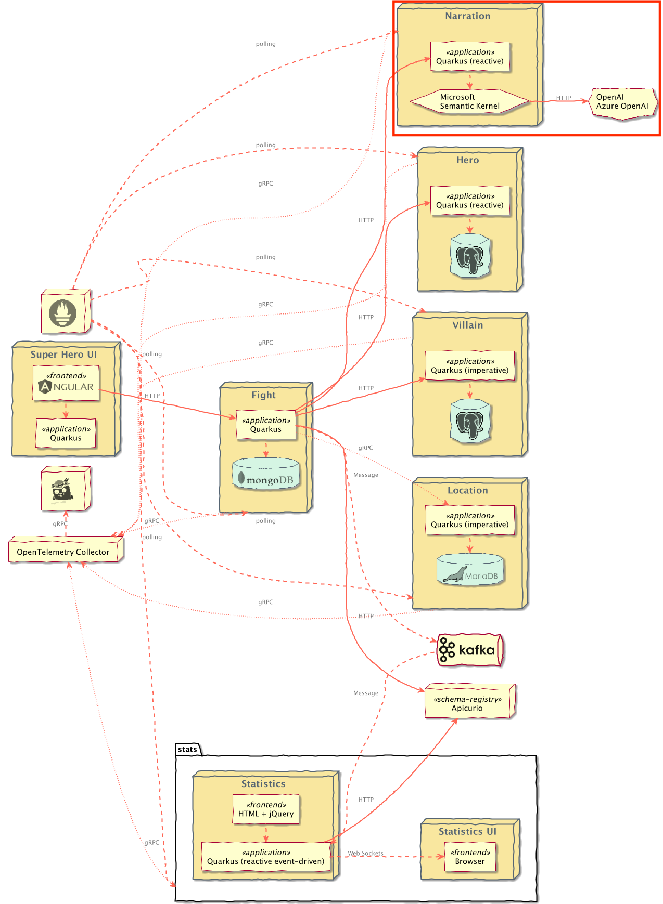

# Superheroes Narration Microservice

> **Full documentation: [https://quarkus.io/quarkus-super-heroes/rest-narration](https://quarkus.io/quarkus-super-heroes/rest-narration)**

## Introduction

This is the Narration REST API microservice. It is a blocking HTTP microservice using the [Quarkus LangChain4J extension](https://docs.quarkiverse.io/quarkus-langchain4j/dev/index.html) to integrate with an AI service to generate text narrating a given fight.

The Narration microservice needs to access an AI service to generate the text narrating the fight. The codebase uses [OpenAI](https://openai.com/) via the [`quarkus-langchain4j-openai` extension](https://docs.quarkiverse.io/quarkus-langchain4j/dev/openai-chat-model.html). Additionally, the service can generate images and image captions from a narration using [DALL-E](https://openai.com/research/dall-e).

This service is implemented using [RESTEasy Reactive](https://quarkus.io/guides/resteasy-reactive) with blocking endpoints. It uses a **contract-first** approach: the REST API interface is generated at build time from the OpenAPI specification ([`src/main/resources/openapi/openapi.yml`](src/main/resources/openapi/openapi.yml)) using the [Quarkiverse OpenAPI Generator Server extension](https://docs.quarkiverse.io/quarkus-openapi-generator/dev/server.html).

Additionally, this application favors constructor injection of beans over field injection (i.e. `@Inject` annotation).

## Running the Application

The application runs on port `8087` (defined by `quarkus.http.port` in [`application.properties`](src/main/resources/application.properties)).

From the `quarkus-super-heroes/rest-narration` directory, simply run `./mvnw quarkus:dev` to run [Quarkus Dev Mode](https://quarkus.io/guides/maven-tooling#dev-mode). The application will be exposed at http://localhost:8087 and the [Quarkus Dev UI](https://quarkus.io/guides/dev-ui) will be exposed at http://localhost:8087/q/dev.
