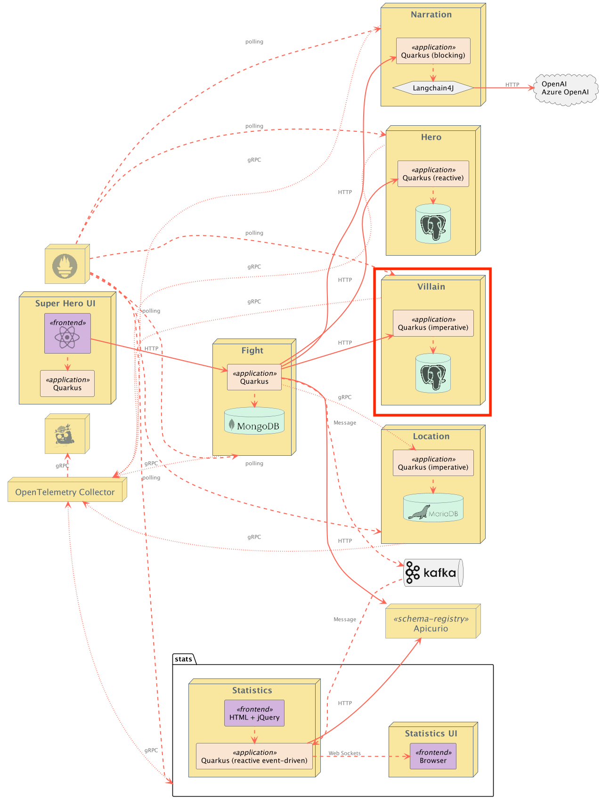

# Superheroes Villain Microservice

This is the Villain REST API microservice. It is a classical HTTP microservice exposing CRUD operations on Villains. Villain information is stored in a PostgreSQL database. This service is implemented using [RESTEasy Reactive](https://quarkus.io/guides/resteasy-reactive) with blocking endpoints and [Quarkus Hibernate ORM with Panache's active record pattern](https://quarkus.io/guides/hibernate-orm-panache).

The following table lists the available REST endpoints. The [OpenAPI document](openapi-schema.yml) for the REST endpoints is also available.

| Path | HTTP method | Response Status | Response Object | Description |
| ---- | ----------- | --------------- | --------------- | ----------- |
| `/api/villains` | `GET` | `200` | [`List<Villain>`](src/main/java/io/quarkus/sample/superheroes/villain/Villain) | All Villains, assuming there is at least 1 |
| `/api/villains` | `GET` | `204` | | No Villains |
| `/api/villains` | `POST` | `201` | | New Villain created. `Location` header contains URL to retrieve Villain |
| `/api/villains` | `POST` | `400` | | Invalid Villain passed in request body (or no request body found) |
| `/api/villains` | `DELETE` | `204` | | Deletes all Villains |
| `/api/villains/random` | `GET` | `200` | [`Villain`](src/main/java/io/quarkus/sample/superheroes/villain/Villain) | Random Villain |
| `/api/villains/random` | `GET` | `404` | | No Villain found |
| `/api/villains/{id}` | `GET` | `200` | [`Villain`](src/main/java/io/quarkus/sample/superheroes/villain/Villain) | Villain with id == `{id}` |
| `/api/villains/{id}` | `GET` | `404` | | No Villain with id == `{id}` found |
| `/api/villains/{id}` | `PUT` | `204` | | Completely replaces a Villain |
| `/api/villains/{id}` | `PUT` | `400` | | Invalid Villain passed in request body (or no request body found) |
| `/api/villains/{id}` | `PUT` | `404` | | No Villain with id == `{id}` found |
| `/api/villains/{id}` | `PATCH` | `200` | [`Villain`](src/main/java/io/quarkus/sample/superheroes/villain/Villain) | Partially updates a Villain. Returns the complete Villain. |
| `/api/villains/{id}` | `PATCH` | `400` | | Invalid Villain passed in request body (or no request body found) |
| `/api/villains/{id}` | `PATCH` | `404` | | No Villain with id == `{id}` found |
| `/api/villains/{id}` | `DELETE` | `204` | | Deletes Villain with id == `{id}` |
| `/api/villains/hello` | `GET` | `200` | `String` | Ping "hello" endpoint |
