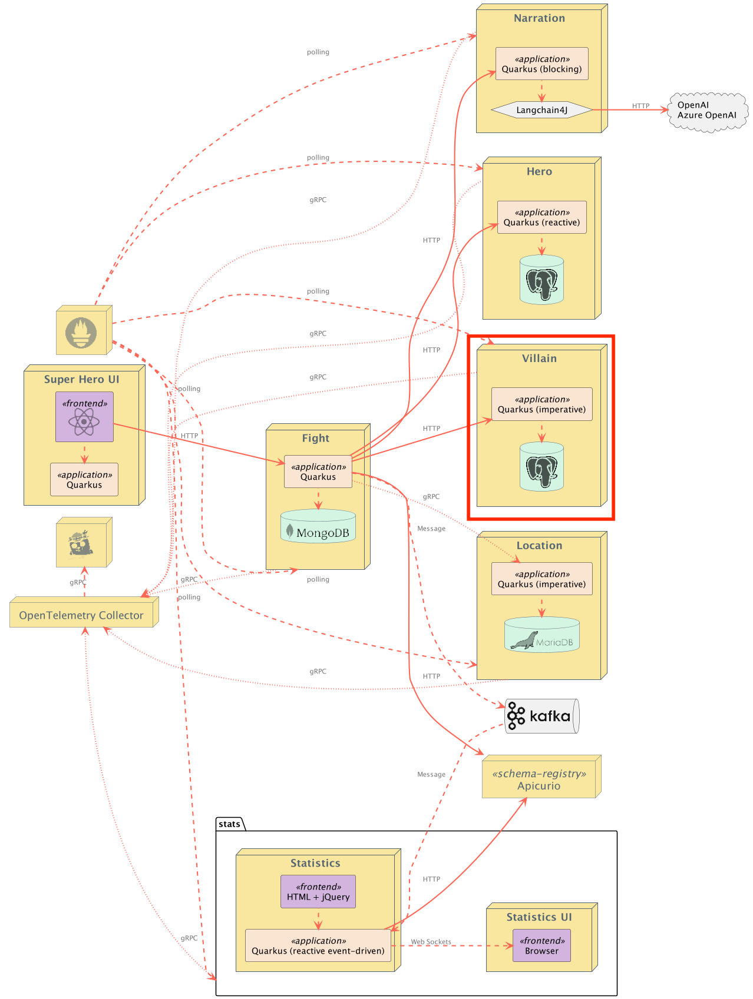
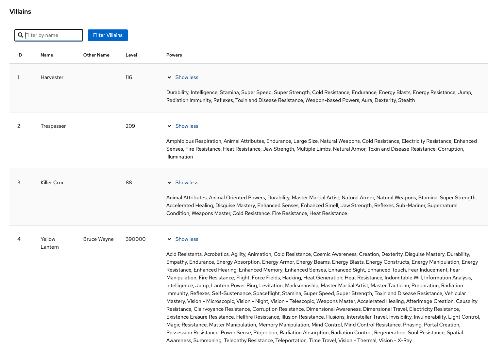

# Superheroes Villain Microservice

> **Full documentation: [https://quarkus.io/quarkus-super-heroes/rest-villains](https://quarkus.io/quarkus-super-heroes/rest-villains)**

## Introduction

This is the Villain REST API microservice. It is a classical HTTP microservice exposing CRUD operations on Villains. Villain information is stored in a PostgreSQL database. This service is implemented using [RESTEasy Reactive](https://quarkus.io/guides/resteasy-reactive) with blocking endpoints and [Quarkus Hibernate ORM with Panache's active record pattern](https://quarkus.io/guides/hibernate-orm-panache#solution-1-using-the-active-record-pattern).

This service uses a **contract-first** approach: the REST API interface is generated at build time from the OpenAPI specification ([`src/main/resources/openapi/openapi.yml`](src/main/resources/openapi/openapi.yml)) using the [Quarkiverse OpenAPI Generator Server extension](https://docs.quarkiverse.io/quarkus-openapi-generator/dev/server.html).

Additionally, this application favors field injection of beans (i.e. `@Inject` annotation) over constructor injection.

## Running the Application

The application runs on port `8084` (defined by `quarkus.http.port` in [`application.properties`](src/main/resources/application.properties)).

From the `quarkus-super-heroes/rest-villains` directory, simply run `./mvnw quarkus:dev` to run [Quarkus Dev Mode](https://quarkus.io/guides/maven-tooling#dev-mode). The application will be exposed at http://localhost:8084 and the [Quarkus Dev UI](https://quarkus.io/guides/dev-ui) will be exposed at http://localhost:8084/q/dev.

