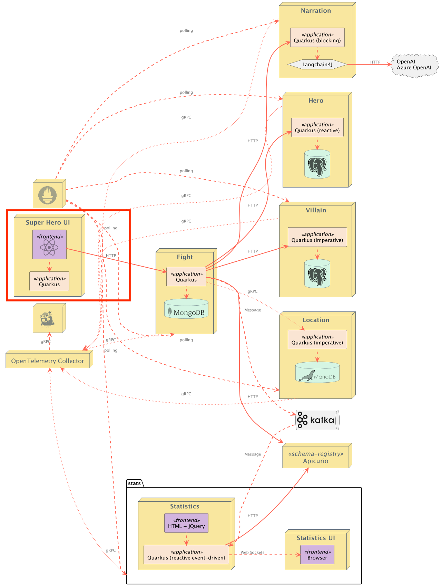
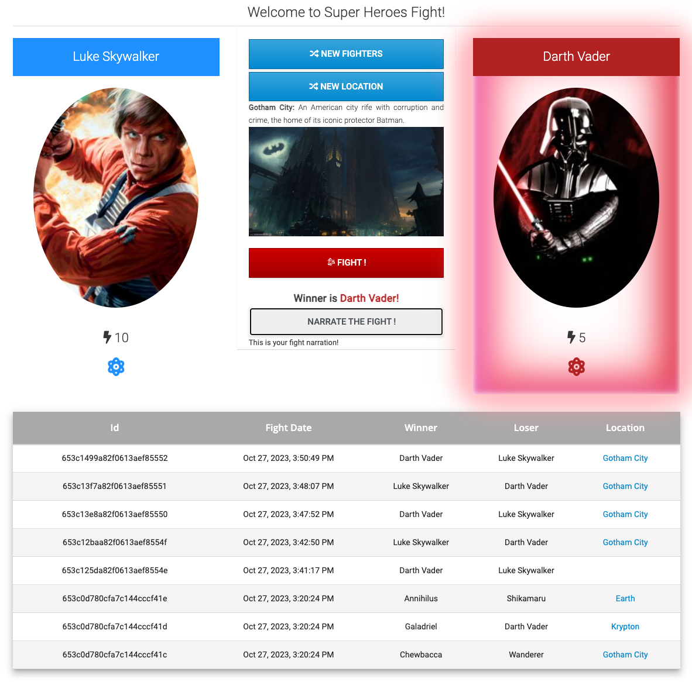

# Superheroes Battle UI

## Table of Contents
- [Introduction](#introduction)
- [Building the Application](#building-the-application)
- [Local Development](#local-development)
- [Running the Application](#running-the-application)
- [Running Locally via Docker Compose](#running-locally-via-docker-compose)
- [Deploying to Kubernetes](#deploying-to-kubernetes)
    - [Routing](#routing)

## Introduction
This is the main user interface for the application. The application is an Angular application served via [Quinoa](https://quarkus.io/extensions/io.quarkiverse.quinoa/quarkus-quinoa).



The main UI allows you to pick up one random Hero and Villain by clicking on "New Fighters." Then it’s just a matter of clicking on "Fight!" to get them to fight. The table at the bottom shows the list of the previous fights.



## Building the Application
Environment variables can be injected into the build using the [ngx-env](https://github.com/chihab/ngx-env) plugin. Remember, these are pulled in at build time and are inserted as string literals in the resulting JS files.

Variables must start with the `NG_APP` prefix, e.g `NG_APP_MY_URL=http://localhost:1234`.

Production builds are served using a Quarkus server. This server serves the compiled Angular application and an `env.js` file. This `env.js` file is generated at startup, and adds a `window.NG_CONFIG` property that the Angular application can read from.

Currently, the `env.js` will expose just the `API_BASE_URL` that's set at runtime. This will control the base URL to connect to the [fights](../rest-fights) service. The default if unset is http://localhost:8082.
You can control the base URL using normal Quarkus configuration, such as setting `api.base.url` in `application.properties` or an `API_BASE_URL` environment variable.


```bash
quarkus package
```

It is also possible to build a native binary, using 

```bash
./mvnw -B clean package -DskipTests -Pnative
```

## Local Development
Use the following command:

```shell
quarkus dev
```

This starts both Quarkus and the Angular hot reloading server at http://localhost:4200. The Quarkus server to supplies the `env.js` file to the Javascript front-end. 

The Quarkus server port can be changed in the usual way, with `application.properties`. 

## Running the Application
1. First you need to start up all of the downstream services ([Heroes Service](../rest-heroes), [Villains Service](../rest-villains), and [Fights Service](../rest-fights)). 
    - The [Event Statistics Service](../event-statistics) is optional.
2. Follow the steps above section, *Building the Application*.
3. Set the `API_BASE_URL` environment variable with the appropriate [Fights Service](../rest-fights) hostname and port.
   > By default, the [`rest-fights`](../rest-fights) service runs on port `8082`, so setting `API_BASE_URL=http://localhost:8082` will do.
4. Start the service using the command `quarkus dev`.
    - You can also set the environment variable `CALCULATE_API_BASE_URL=true` to have it compute the base URL. Only use this option if the UI url is in the form of `ui-super-heroes.somewhere.com`. In this instance, setting `CALCULATE_API_BASE_URL=true` will replace `ui-super-heroes` in the URL with `rest-fights`.

There is also a container image available that you can use instead:

 ```bash
docker run -p 8080:8080 -e API_BASE_URL=http://localhost:8082 quay.io/quarkus-super-heroes/ui-super-heroes:latest
```

## Running Locally via Docker Compose
Pre-built images for this application can be found at [`quay.io/quarkus-super-heroes/ui-super-heroes`](https://quay.io/repository/quarkus-super-heroes/ui-super-heroes?tab=tags).

The application can be started outside of docker compose simply with `docker run -p 8080:8080 quay.io/quarkus-super-heroes/ui-super-heroes:latest`.

If you want to use docker compose, from the `quarkus-super-heroes/ui-super-heroes` directory run:

```bash
docker-compose -f deploy/docker-compose/java17.yml up
```

or 

```bash
docker-compose -f deploy/docker-compose/native.yml up
```

If you want to stand up the entire system, [follow these instructions](../README.md#running-locally-via-docker-compose).

Once started the application will be exposed at `http://localhost:8080`.

## Deploying to Kubernetes
The application can be [deployed to Kubernetes using pre-built images](#using-pre-built-images) or by [deploying directly via the Quarkus Kubernetes Extension](#deploying-directly-via-kubernetes-extensions). Each of these is discussed below.

### Using pre-built images
Pre-built images for this application can be found at [`quay.io/quarkus-super-heroes/ui-super-heroes`](https://quay.io/repository/quarkus-super-heroes/ui-super-heroes?tab=tags).

Deployment descriptors for these images are provided in the [`deploy/k8s`](deploy/k8s) directory. There are versions for [OpenShift](https://www.openshift.com), [Minikube](https://quarkus.io/guides/deploying-to-kubernetes#deploying-to-minikube), [Kubernetes](https://www.kubernetes.io), and [KNative](https://knative.dev).

Pick one of the 4 versions of the application from the table below and deploy the appropriate descriptor from the [`deploy/k8s` directory](deploy/k8s).

| Description | Image Tag       | OpenShift Descriptor                                      | Minikube Descriptor                                     | Kubernetes Descriptor                                       | KNative Descriptor                                    |
|-------------|-----------------|-----------------------------------------------------------|---------------------------------------------------------|-------------------------------------------------------------|-------------------------------------------------------|
| JVM Java 17 | `java17-latest` | [`java17-openshift.yml`](deploy/k8s/java17-openshift.yml) | [`java17-minikube.yml`](deploy/k8s/java17-minikube.yml) | [`java17-kubernetes.yml`](deploy/k8s/java17-kubernetes.yml) | [`java17-knative.yml`](deploy/k8s/java17-knative.yml) |
| Native      | `native-latest` | [`native-openshift.yml`](deploy/k8s/native-openshift.yml) | [`native-minikube.yml`](deploy/k8s/native-minikube.yml) | [`native-kubernetes.yml`](deploy/k8s/native-kubernetes.yml) | [`native-knative.yml`](deploy/k8s/native-knative.yml) |

The application is exposed outside of the cluster on port `80`.

These are only the descriptors for this application and the required database only. If you want to deploy the entire system, [follow these instructions](../README.md#deploying-to-kubernetes).

### Deploying directly via Kubernetes Extensions
Following the [deployment section](https://quarkus.io/guides/deploying-to-kubernetes#deployment) of the [Quarkus Kubernetes Extension Guide](https://quarkus.io/guides/deploying-to-kubernetes) (or the [deployment section](https://quarkus.io/guides/deploying-to-openshift#build-and-deployment) of the [Quarkus OpenShift Extension Guide](https://quarkus.io/guides/deploying-to-openshift) if deploying to [OpenShift](https://openshift.com)), you can run one of the following commands to deploy the application and any of its dependencies (see [Kubernetes (and variants) resource generation](../docs/automation.md#kubernetes-and-variants-resource-generation) of the [automation strategy document](../docs/automation.md)) to your preferred Kubernetes distribution.

> **NOTE:** For non-OpenShift or minikube Kubernetes variants, you will most likely need to [push the image to a container registry](https://quarkus.io/guides/container-image#pushing) by adding the `-Dquarkus.container-image.push=true` flag, as well as setting the `quarkus.container-image.registry`, `quarkus.container-image.group`, and/or the `quarkus.container-image.name` properties to different values.

| Target Platform        | Java Version | Command                                                                                                                                                                                                                                      |
|------------------------|:------------:|----------------------------------------------------------------------------------------------------------------------------------------------------------------------------------------------------------------------------------------------|
| Kubernetes             |      17      | `./mvnw clean package -Dquarkus.profile=kubernetes -Dquarkus.kubernetes.deploy=true -DskipTests`                                                                                                                                             |
| OpenShift              |      17      | `./mvnw clean package -Dquarkus.profile=openshift -Dquarkus.container-image.registry=image-registry.openshift-image-registry.svc:5000 -Dquarkus.container-image.group=$(oc project -q) -Dquarkus.kubernetes.deploy=true -DskipTests`         |
| Minikube               |      17      | `./mvnw clean package -Dquarkus.profile=minikube -Dquarkus.kubernetes.deploy=true -DskipTests`                                                                                                                                               |
| KNative                |      17      | `./mvnw clean package -Dquarkus.profile=knative -Dquarkus.kubernetes.deploy=true -DskipTests`                                                                                                                                                |
| KNative (on OpenShift) |      17      | `./mvnw clean package -Dquarkus.profile=knative-openshift -Dquarkus.container-image.registry=image-registry.openshift-image-registry.svc:5000 -Dquarkus.container-image.group=$(oc project -q) -Dquarkus.kubernetes.deploy=true -DskipTests` |

You may need to adjust other configuration options as well (see [Quarkus Kubernetes Extension configuration options](https://quarkus.io/guides/deploying-to-kubernetes#configuration-options) and [Quarkus OpenShift Extension configuration options](https://quarkus.io/guides/deploying-to-openshift#configuration-reference)).

> The [`do_build` function in the `generate-k8s-resources.sh` script](../scripts/generate-k8s-resources.sh) uses these extensions to generate the manifests in the [`deploy/k8s` directory](deploy/k8s).

### Routing
There are 2 environment variables that can be set on this application to control how the Angular UI communicates with the [`rest-fights`](../rest-fights) application:

| Env Var                  | Default Value                                        | Description                                                                                                                                                                                                                                                                                                      |
|--------------------------|------------------------------------------------------|------------------------------------------------------------------------------------------------------------------------------------------------------------------------------------------------------------------------------------------------------------------------------------------------------------------|
| `API_BASE_URL`           | `undefined`                                          | The base URL for the [`rest-fights`](../rest-fights) application.  Set this to a fully qualified URL (i.e. http://www.example.com or http://somehost.com:someport) to define the URL for the [`rest-fights`](../rest-fights) application.                                                                        |
| `CALCULATE_API_BASE_URL` | `false` on Minikube/Kubernetes. `true` on OpenShift. | If `true`, look at the URL in the browser and replace the `ui-super-heroes` host name with `rest-fights`. This is because on OpenShift, each application has its own `Route` which exposes a unique hostname within the cluster. On Minikube and Kubernetes, an `Ingress` using different paths is used instead. |
