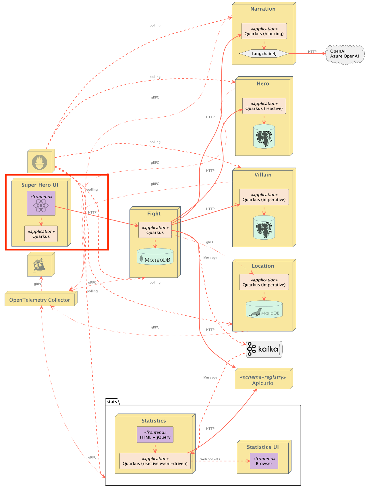

# Superheroes Battle UI

> **Full documentation: [https://quarkus.io/quarkus-super-heroes/ui-super-heroes](https://quarkus.io/quarkus-super-heroes/ui-super-heroes)**

## Introduction

This is the main user interface for the application. The application is a React application served via [Quinoa](https://quarkus.io/extensions/io.quarkiverse.quinoa/quarkus-quinoa).

The main UI allows you to pick up one random Hero and Villain by clicking on "New Fighters", then pick a random location for the fight to take place by clicking on "New Location". Then it's just a matter of clicking on "Fight!" to get them to fight. The table at the bottom shows the list of the previous fights.

## Running the Application

From the `quarkus-super-heroes/ui-super-heroes` directory, simply run `quarkus dev` to start both the Quarkus server and the React hot reloading server at http://localhost:3000.

The application uses [Microcks](https://microcks.io) in dev mode by default to provide mock responses from downstream services, so no other services need to be running.

